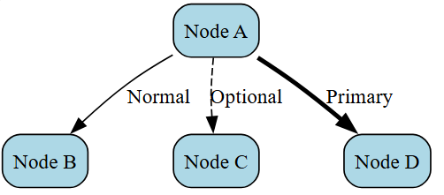

# Graphviz DOT Language Guide: Using stzDotCode

## Introduction: Why Graphviz in SoftAnza?

Graphviz has been integrated into the Softanza ExerCode framework to provide a powerful, code-driven approach to creating professional diagrams. Rather than building visualizations through UI interactions, Graphviz allows developers to **define diagrams as structured text**, making them version-controllable, reproducible, and programmatically generated.


### Basic Usage Pattern

```ring
Dot = new stzDotCode()
Dot.SetCode('digraph MyGraph { A -> B; }')
Dot.ExecuteAndView()
```


## Core Concepts

### Graph Types

DOT supports two fundamental structures:

**Directed Graphs** - For workflows, hierarchies, and dependencies:
```ring
Dot = new stzDotCode()

Dot.SetCode('
digraph MyWorkflow {
    Start -> Process -> End
}
')

Dot.RunAndView()
```


**Undirected Graphs** - For networks, relationships, and physical connections:
```ring
Dot = new stzDotCode()

Dot.SetCode('
graph MyNetwork {
    ServerA -- ServerB
    ServerB -- ServerC
}
')

Dot.Run()
Dot.View()
```


### The Three Levels of Attributes

Graphviz styling works hierarchically:

```ring
Dot = new stzDotCode()

Dot.SetCode('
digraph G {
    # Graph-level: affects entire diagram
    graph [rankdir=LR, bgcolor=white]
    
    # Node-level: affects all nodes
    node [shape=box, style=filled, fillcolor=lightblue]
    
    # Edge-level: affects all edges
    edge [color=gray, penwidth=2]
    
    # Individual node: overrides defaults
    Important [fillcolor=orange]
    
    # Individual edge: overrides defaults
    Important -> Critical [color=darkred, penwidth=4]
}
')

Dot.ExecuteXT()
```

The more specific level always wins. An individual node's `fillcolor` overrides the default node attribute.


## Node Shapes: Building Your Visual Language

Nodes are the "nouns" of your diagram. Shape choice communicates meaning.

### Common Shapes and Their Purposes

| Shape | Ring Code | Best For |
|-------|-----------|----------|
| Box | `shape=box` | Processes, tasks, events |
| Circle | `shape=circle` | States, simple items |
| Ellipse | `shape=ellipse` | Start/end points, default |
| Diamond | `shape=diamond` | Decisions, conditions |
| Record | `shape=record` | Data structures, tables |
| Cylinder | `shape=cylinder` | Databases, storage |
| Component | `shape=component` | Hardware, modules |
| Trapezium | `shape=trapezium` | Input/output |
| Parallelogram | `shape=parallelogram` | Data input |

### Shape Example

```ring
Dot = new stzDotCode()

Dot.SetCode('
digraph Shapes {
    graph [rankdir=LR]
    node [style=filled, fontname="Arial"]
    
    box_node [shape=box, fillcolor=lightblue, label="Process"]
    circle_node [shape=circle, fillcolor=lightgreen, label="State"]
    decision [shape=diamond, fillcolor=yellow, label="Decision?"]
    
    box_node -> circle_node -> decision
}
')

Dot.SetOutputFile("shapes.svg")
Dot.ExecuteAndView()
```

A horizontal diagram showing three different node shapes connected by arrows.


## Edges: Connecting Your Ideas

Edges represent relationships. Their styling communicates the nature of that relationship.

### Edge Styling Options

```ring
Dot = new stzDotCode()

Dot.SetCode('
digraph EdgeStyles {
    graph [rankdir=TB, nodesep=0.8]
    node [shape=box, style="rounded,filled", fillcolor=lightblue]
    
    A [label="Node A"]
    B [label="Node B"]
    C [label="Node C"]
    D [label="Node D"]
    
    # Normal solid edge
    A -> B [label="Normal"]
    
    # Dashed: optional or weak connection
    A -> C [label="Optional", style=dashed]
    
    # Bold: strong or primary path
    A -> D [label="Primary", style=bold, penwidth=3]
}
')

Dot.RunAndView()
```


### Arrow Types

ring

```ring
Dot = new stzDotcode()

Dot.SetCode('
digraph ArrowTypes {
    graph [rankdir=LR, nodesep=0.8]
    node [shape=box, style="rounded,filled", fillcolor=lightblue]
    edge [fontname="Arial", fontsize=10]
    
    A [label="Node A"]
    B [label="Normal"]
    C [label="Dot"]
    D [label="Diamond"]
    E [label="Both"]
    F [label="Back"]
    G [label="None"]
    
    A -> B [arrowhead=normal, label="normal"]
    A -> C [arrowhead=dot, label="dot"]
    A -> D [arrowhead=diamond, label="diamond"]
    A -> E [dir=both, label="both"]
    A -> F [dir=back, label="back"]
    A -> G [dir=none, label="none"]
}
')
Dot.SetOutputFile("arrow_types.svg")
Dot.ExecuteAndView()
```

Seven edges from Node A to different target nodes, each demonstrating a different arrow style.


## Layout Control: Directing Flow

The layout determines how your diagram reads.

### Rank Direction (rankdir)

ring

```ring
graph [rankdir=TB]  # Top to Bottom (default) - natural reading
graph [rankdir=LR]  # Left to Right - timelines, processes
graph [rankdir=BT]  # Bottom to Top - dependencies building upward
graph [rankdir=RL]  # Right to Left - uncommon, reverse flow
```

**Choosing rankdir:**

* **TB**: Hierarchies, org charts, processes (most intuitive)
* **LR**: Timelines, sequences, system architectures (left-to-right reading)
* **BT**: Dependency trees (showing what feeds into what)
* **RL**: Alternative direction (rarely used)


### Alignment: Same Rank

Force nodes onto the same horizontal or vertical level:

ring

```ring
dot = new stzDotCode()

Dot.SetCode('
digraph Timeline {
    graph [rankdir=LR]
    node [shape=box]
    
    # Time markers on same rank
    {rank=same; t1, t2, t3, t4}
    t1 [label="Week 1"]
    t2 [label="Week 2"]
    t3 [label="Week 3"]
    t4 [label="Week 4"]
    
    # Tasks aligned with times
    {rank=same; t1, task1}
    task1 [label="Planning"]
    
    {rank=same; t2, task2}
    task2 [label="Development"]
    
    t1 -> t2 -> t3 -> t4
    task1 -> task2
}
')

Dot.RunAndView()
```


## Clusters: Grouping Related Nodes

Clusters create visual groupings with boundaries. They're essential for showing organizational structure, system layers, or process phases.

### Creating Clusters

ring

```ring
Dot.SetCode('
digraph Architecture {
    graph [rankdir=TB, compound=true]
    node [shape=box, style="rounded,filled"]
    
    # Frontend cluster
    subgraph cluster_frontend {
        label="Frontend Layer"
        style=filled
        fillcolor=lightblue
        color=blue
        
        ui [label="User Interface", fillcolor=skyblue]
        controller [label="Controller", fillcolor=skyblue]
        ui -> controller
    }
    
    # Backend cluster
    subgraph cluster_backend {
        label="Backend Layer"
        style=filled
        fillcolor=lightgreen
        color=green
        
        api [label="REST API", fillcolor=palegreen]
        logic [label="Business Logic", fillcolor=palegreen]
        api -> logic
    }
    
    # Cross-cluster connections
    controller -> api [lhead=cluster_backend, label="HTTP"]
}
')
```

**Key points:**

* Cluster names must start with `cluster_` to get a visual box
* Use `lhead` and `ltail` for clean cross-cluster connections
* Set `compound=true` at graph level to enable these features


## Color and Style: Visual Communication

Color choices convey meaning and hierarchy.

### Built-in Color Schemes

Rather than random colors, use schemes for consistency:

ring

```ring
node [colorscheme=blues9]
A [fillcolor=1]   # Lightest blue
B [fillcolor=5]   # Medium blue
C [fillcolor=9]   # Darkest blue, fontcolor=white for readability
```

**Popular schemes:**

* `blues9, reds9, greens9` - Monochromatic, 9 shades
* `paired12` - Complementary pairs
* `set19` - Distinct colors for categories

### Style Combinations

ring

```ring
node [style="filled"]              # Just fill color
node [style="rounded,filled"]      # Rounded corners + fill
node [style="dashed"]              # Dashed outline
node [style="bold,filled"]         # Thicker outline + fill
```

### Color Psychology

Use colors consistently:

* **Green** - Success, approval, "go"
* **Red** - Error, stop, critical
* **Yellow/Orange** - Warning, caution
* **Blue** - Information, process, neutral
* **Gray** - Inactive, optional, deprecated

***

## Advanced: Record Shapes

Record shapes create multi-part nodes useful for data structures, class diagrams, or complex information.

ring

```ring
Dot.SetCode('
digraph Records {
    graph [rankdir=LR]
    node [fontname="Courier"]
    
    # Simple record with vertical sections
    simple [shape=record, label="Header|Body|Footer"]
    
    # Record with named ports
    struct [shape=record, 
            label="<name>User|<email>john@example.com|<id>EMP-123"]
    
    # Complex record
    class [shape=record, style=filled, fillcolor=lightblue,
           label="{<title>MyClass|<attrs>- id: int\l- name: string\l|<methods>+ getData()\l+ setData()\l}"]
}
')
```

Port notation:

* `|` separates vertical sections
* `<name>` creates a named connection point
* `{}` subdivides sections horizontally


## Practical Patterns

### Organization Chart

ring

```ring
Do = new stzDotCode()

Dot.SetCode('
digraph Hierarchy {
    graph [rankdir=TB, splines=ortho, nodesep=0.6, ranksep=0.8]
    node [shape=box, style="rounded,filled", fontname="Arial"]
    edge [color=gray40, arrowsize=0.8]
    
    # Force same rank for specific nodes
    {rank=same; CEO}
    {rank=same; VP_Sales, VP_Eng, VP_Ops}
    {rank=same; Sales_A, Sales_B, Dev_A, Dev_B, Ops_A, Ops_B}
    
    CEO [fillcolor=gold, fontcolor=black, label="CEO"]
    
    VP_Sales [fillcolor=lightcoral, label="VP Sales"]
    VP_Eng [fillcolor=lightblue, label="VP Engineering"]
    VP_Ops [fillcolor=lightgreen, label="VP Operations"]
    
    Sales_A [fillcolor=mistyrose, label="Sales Rep A"]
    Sales_B [fillcolor=mistyrose, label="Sales Rep B"]
    Dev_A [fillcolor=lightcyan, label="Developer A"]
    Dev_B [fillcolor=lightcyan, label="Developer B"]
    Ops_A [fillcolor=honeydew, label="Ops Staff A"]
    Ops_B [fillcolor=honeydew, label="Ops Staff B"]
    
    CEO -> {VP_Sales, VP_Eng, VP_Ops} [penwidth=2]
    VP_Sales -> {Sales_A, Sales_B}
    VP_Eng -> {Dev_A, Dev_B}
    VP_Ops -> {Ops_A, Ops_B}
}

Dot.RunAndView()
```


### State Machine

ring

```ring
Do = new stzDotCode()

Dot.SetCode('
digraph StateMachine {
    graph [rankdir=LR, bgcolor=white, fontname="Arial"]
    node [fontname="Arial", style=filled]
    edge [fontname="Arial", fontsize=10]
    
    # Special states
    start [shape=circle, fillcolor=black, width=0.3, label=""]
    end [shape=doublecircle, fillcolor=black, width=0.3, label=""]
    
    # Regular states
    idle [shape=circle, fillcolor=lightblue, label="Idle"]
    processing [shape=circle, fillcolor=yellow, label="Processing"]
    waiting [shape=circle, fillcolor=orange, label="Waiting"]
    complete [shape=circle, fillcolor=lightgreen, label="Complete"]
    error [shape=circle, fillcolor=red, fontcolor=white, label="Error"]
    
    # Transitions
    start -> idle [label="init"]
    idle -> processing [label="start()"]
    processing -> waiting [label="wait_for_input()"]
    processing -> complete [label="success"]
    processing -> error [label="exception"]
    waiting -> processing [label="input_received()"]
    waiting -> error [label="timeout"]
    error -> idle [label="retry()", style=dashed]
    complete -> end [label="finalize"]
    
    # Self-loop
    idle -> idle [label="ping()", style=dotted]
}
')

Dot.SetOutputFile("state_machine.svg")
Dot.ExecuteAndView()
```

### Process Workflow

ring

```ring
Dot.SetCode('
digraph Workflow {
    graph [rankdir=LR, splines=ortho]
    node [shape=box, style="rounded,filled"]
    
    start [shape=circle, fillcolor=green, label="Start"]
    input [fillcolor=lightblue, label="Input Data"]
    process [fillcolor=lightyellow, label="Process"]
    decision [shape=diamond, fillcolor=gold, label="Valid?"]
    output [fillcolor=lightgreen, label="Output"]
    error [fillcolor=lightcoral, label="Error"]
    end [shape=circle, fillcolor=red, label="End"]
    
    start -> input -> process -> decision
    decision -> output [label="Yes"]
    decision -> error [label="No"]
    output -> end
    error -> end
}
')
Dot.SetOutputFile("workflow.svg")
Dot.ExecuteAndView()
```


## Best Practices

### 1. Start Simple, Build Complexity

Begin with basic nodes and edges, then add styling and structure.

ring

```ring
# Version 1: Structure
Dot.SetCode('
digraph G {
    A -> B -> C
}
')

# Version 2: Styling
Dot.SetCode('
digraph G {
    node [shape=box, style=filled]
    A [fillcolor=lightblue]
    B [fillcolor=lightgreen]
    C [fillcolor=lightyellow]
    A -> B -> C
}
')
```

### 2. Use Consistent Styling

Group similar elements with the same appearance:

ring

```ring
Dot.SetCode('
digraph G {
    # All processes: blue boxes
    node [shape=box, fillcolor=lightblue]
    process1; process2; process3
    
    # All decisions: gold diamonds
    node [shape=diamond, fillcolor=gold]
    decision1; decision2
    
    # All endpoints: circles
    node [shape=circle, fillcolor=green]
    start; end
}
')
```

### 3. Label Everything

Clear labels are essential for understanding:

ring

```ring
# Bad: unclear
A [label="X"]

# Good: descriptive
user_input [label="User\nEnters Data"]
```

### 4. Use rankdir Intentionally

Match the reading direction to your audience's expectations:

ring

```ring
# Org chart: top-down
graph [rankdir=TB]

# Timeline: left-to-right
graph [rankdir=LR]

# Build process: bottom-up
graph [rankdir=BT]
```

### 5. Limit Density

Too many connections or nodes creates visual chaos:

* Use clusters to group related items
* Use separate diagrams for different aspects
* Consider breaking complex flows into stages


## Troubleshooting

### Diagram Not Rendering

**Issue:** stzDotCode throws an error or file isn't created.

**Check:**

1. Graphviz is installed (`dot.exe` exists at specified path)
2. DOT code has matching braces `{ }`
3. No syntax errors (semicolons at line ends)
4. Output directory exists and is writable

### Nodes Overlapping

**Issue:** Nodes are cramped together.

**Solutions:**

ring

```ring
graph [rankdir=TB, nodesep=0.8, ranksep=1.0]  # More spacing
graph [splines=ortho]  # Right-angle edges, less overlap
graph [overlap=false]  # Force layout algorithm to avoid overlaps
```

### Edges Too Complicated

**Issue:** Lines cross and tangle.

**Solutions:**

* Use `splines=ortho` for clean right-angle lines
* Use `rankdir=LR` instead of TB for certain hierarchies
* Break into multiple clusters
* Consider separate diagrams for different aspects

### Output File Not Where Expected

Remember the directory structure:

ring

```ring
Dot.SetOutputDir("output")          # Sets base directory
Dot.SetOutputFile("diagram.svg")    # Creates output/diagram.svg
Dot.SetOutputFile("subdir/diagram.svg")  # Creates output/subdir/diagram.svg
```

## Summary

Graphviz's text-based approach to diagram creation enables:

✓ **Version Control** - Diagrams in Git alongside code ✓ **Automation** - Generate diagrams from data programmatically ✓ **Reproducibility** - Same input always produces same output ✓ **Scale** - Create hundreds of diagrams without UI interaction ✓ **Integration** - Embed diagram generation into applications

stzDotCode is your programmatic bridge to this power. Master the DOT language fundamentals, and you unlock the ability to create professional, maintainable diagram infrastructure within SoftAnza.
