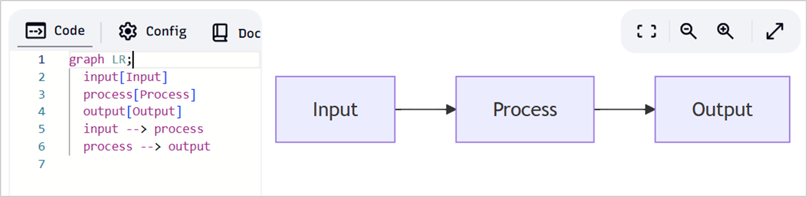

# stzGraph: The Art of Connected Thinking

## The Beauty of Graphs

A **graph** is a profound yet elegant concept in computer science—a structure of **nodes** (entities) and **edges** (relationships) that reveals how systems connect, interact, and evolve. Whether modeling **workflows**, **codebases**, **data schemas**, or **conversational logic**, `stzGraph` transforms complexity into clarity. With a syntax that mirrors human reasoning, it makes relationships not just visible but **intuitive, explorable, and actionable**—directly from your terminal.

`stzGraph` is more than a tool; it’s a way to **think in systems**, where flows of influence, chains of dependency, and cycles of cause and effect come alive. Its lightweight, dependency-free design and powerful features make it a universal foundation for reasoning about any relational system.

---

## Quick Start: From Vision to Reality

Create a graph, visualize it, query it, and enrich it with metadata in just a few lines:

```ring
oGraph = new stzGraph("MyFlow")
oGraph {
    AddNode(:@start, "Start")
    AddNode(:@middle, "Process")
    AddNode(:@end, "End")
    
    AddEdge(:@start, :@middle, "flows")
    AddEdge(:@middle, :@end, "completes")
    
    Show()
}
```

Output:

```
        ╭───────╮        
        │ Start │        
        ╰───────╯        
            |            
          flows          
            |            
            v            
      ╭───────────╮      
      │ !Process! │      
      ╰───────────╯      
            |            
        completes        
            |            
            v            
         ╭─────╮         
         │ End │         
         ╰─────╯
```

Switch to a horizontal view with `ShowH()`:

```
╭───────╮          ╭───────────╮              ╭─────╮
│ Start │--flows-->│ !Process! │--completes-->│ End │
╰───────╯          ╰───────────╯              ╰─────╯
```

Quick queries:

```ring
? oGraph.NodeCount()                #--> 3
? oGraph.PathExists(:@start, :@end) #--> TRUE
```

Enrich nodes with domain-specific metadata:

```ring
oGraph.AddNodeXT(:@middle, "Process", [
    :priority = "high",
    :owner = "team-a"
])
```

`stzGraph` feels like a conversation with your system—declare relationships, and it responds with insights. No setup, no dependencies, just **connected logic**.

## A Natural API: Code That Thinks Like You

The `stzGraph` API is designed to mirror how you reason about systems. Ask a question, and the method answers directly:

| Your Question             | Method                                          | Returns             |
|---------------------------|-------------------------------------------------|---------------------|
| Can A reach B?            | `PathExists(:@a, :@b)`                          | TRUE / FALSE        |
| What are all paths from A to B? | `FindAllPaths(:@a, :@b)`                  | Array of paths      |
| Are there loops?          | `CyclicDependencies()`                          | TRUE / FALSE        |
| What does X influence?    | `ReachableFrom(:@x)`                            | Array of nodes      |
| Which nodes are critical? | `BottleneckNodes()`                             | Array of IDs        |
| How connected is the graph? | `NodeDensity()`                               | % (0–100)           |
| What’s the longest chain? | `LongestPath()`                                 | Edge count          |
| What connects to X?       | `NeighborsOf(:@x)`                              | Array of nodes      |
| What leads to X?          | `IncomingTo(:@x)`                               | Array of nodes      |
| Describe the graph        | `Explain()`                                     | Structured analysis |
| Does this exist?          | `NodeExists(:@id)` / `EdgeExists(:@from, :@to)` | TRUE / FALSE        |
| Show vertical view        | `Show()` / `ShowV()`                            | ASCII diagram       |
| Show horizontal view      | `ShowH()` / `ShowHorizontal()`                  | ASCII diagram       |
| Show with annotations     | `ShowWithLegend()`                              | ASCII + legend      |

The API speaks your language, turning thoughts into code with no friction.

## Connectivity: Mapping the Possible

Every system tells a story. `stzGraph` lets you ask: **Can this process reach its goal?**

```ring
oWorkflow = new stzGraph("ApprovalProcess")
oWorkflow {
    AddNode(:@request, "Request")
    AddNode(:@manager, "Manager")
    AddNode(:@approved, "Approved")
    
    AddEdge(:@request, :@manager, "submit")
    AddEdge(:@manager, :@approved, "finalize")
    
    Show()
}
```

Output:

```
       ╭─────────╮       
       │ Request │       
       ╰─────────╯       
            |            
         submit          
            |            
            v            
      ╭───────────╮      
      │ !Manager! │      
      ╰───────────╯      
            |            
        finalize         
            |            
            v            
      ╭──────────╮       
      │ Approved │       
      ╰──────────╯  
```

Query:

```ring
? oWorkflow.PathExists(:@request, :@approved)  #--> TRUE
```

## Alternative Routes: Exploring All Paths

Real systems branch and converge. `stzGraph` reveals every possible route:

```ring
oProcess = new stzGraph("MultiPathProcess")
oProcess {
    AddNode(:@start, "Start")
    AddNode(:@fast, "Fast Path")
    AddNode(:@standard, "Standard Path")
    AddNode(:@end, "Complete")
    
    AddEdge(:@start, :@fast, "expedited")
    AddEdge(:@start, :@standard, "normal")
    AddEdge(:@fast, :@end, "finish")
    AddEdge(:@standard, :@end, "finish")
    
    Show()
}
```

Output (branches separated by `////`):

```
        ╭───────╮        
        │ Start │        
        ╰───────╯        
            |            
        expedited        
            |            
            v            
      ╭───────────╮      
      │ Fast Path │      
      ╰───────────╯      
            |            
         finish          
            |            
            v            
      ╭──────────╮       
      │ Complete │       
      ╰──────────╯       

          ////

        ╭───────╮  ↑
        │ Start │──╯
        ╰───────╯        
            |            
         normal          
            |            
            v            
    ╭───────────────╮    
    │ Standard Path │    
    ╰───────────────╯    
            |            
         finish          
            |            
            v            
      ╭──────────╮       
      │ Complete │       
      ╰──────────╯       
```

Query the routes:

```ring
aPaths = oProcess.FindAllPaths(:@start, :@end)
? len(aPaths)  #--> 2
```

## Independent Branches: Parallel Power

Identify branches that can run concurrently:

```ring
? oProcess.ParallelizableBranches()  #--> [[:@fast, :@standard]]
? oProcess.DependencyFreeNodes()    #--> [:@start]
```

This unlocks insights for optimizing workflows, code execution, or operations.

## Cyclic Dependencies: Illuminating Feedback Loops

`stzGraph` doesn’t just detect cycles—it visualizes them clearly:

```ring
oCyclic = new stzGraph("CyclicStructure")
oCyclic {
    AddNode(:@p1, "P1")
    AddNode(:@p2, "P2")
    AddNode(:@p3, "P3")
    
    AddEdge(:@p1, :@p2, "")
    AddEdge(:@p2, :@p3, "")
    AddEdge(:@p3, :@p1, "")
    
    Show()
}
```

Output (cycle highlighted):

```
         ╭────╮          
         │ P1 │          
         ╰────╯          
            |            
            v            
         ╭────╮          
         │ P2 │          
         ╰────╯          
            |            
            v            
         ╭────╮          
         │ P3 │          
         ╰────╯          
            |            
      <CYCLE: >   
            |           ↑
            ╰──> [P1] ──╯
```

```ring
? oCyclic.CyclicDependencies()  #--> TRUE
```

## Structural Constraints: Ensuring Soundness

Enforce design rules to maintain system integrity:

```ring
oGraph = new stzGraph("DAGStructure")
oGraph {
    AddNode(:@a, "A")
    AddNode(:@b, "B")
    AddNode(:@c, "C")
    
    AddConstraint("ACYCLIC")
    AddConstraint("CONNECTED")
    
    AddCustomConstraint("NO_ORPHANS", func {
        return len(This.DependencyFreeNodes()) = 1
    })
    
    AddEdge(:@a, :@b, "")
    AddEdge(:@b, :@c, "")
}

? oGraph.ValidateConstraints()  #--> TRUE
```

Constraints like `ACYCLIC`, `CONNECTED`, and custom rules ensure your graph aligns with your design goals, catching flaws early.

## Reachability: Measuring Influence

Identify hubs that drive system behavior:

```ring
oHierarchy = new stzGraph("TypeSystem")
oHierarchy {
    AddNode(:@entity, "Entity")
    AddNode(:@person, "Person")
    AddNode(:@employee, "Employee")
    AddNode(:@manager, "Manager")
    
    AddEdge(:@entity, :@person, "is_a")
    AddEdge(:@person, :@employee, "is_a")
    AddEdge(:@employee, :@manager, "is_a")
    
    Show()
}
```

Output:

```
       ╭────────╮        
       │ Entity │        
       ╰────────╯        
            |            
          is_a           
            |            
            v            
      ╭──────────╮       
      │ !Person! │       
      ╰──────────╯       
            |            
          is_a           
            |            
            v            
     ╭────────────╮      
     │ !Employee! │      
     ╰────────────╯      
            |            
          is_a           
            |            
            v            
       ╭─────────╮       
       │ Manager │       
       ╰─────────╯  
```

Query:

```ring
? oHierarchy.ReachableFrom(:@person)  #--> [:@person, :@employee, :@manager]
? oHierarchy.Explain()
```

Output:

```
Graph: TypeSystem
Nodes: 4 | Edges: 3
Bottleneck nodes: @person, @employee
No cycles - DAG
Density: 25% | Longest path: 3 hops
```

## Bottlenecks: Finding Critical Hubs

Spot nodes where paths converge:

```ring
oGraph = new stzGraph("BottleneckTest")
oGraph {
    AddNode(:@a, "A")
    AddNode(:@b, "B")
    AddNode(:@c, "C")
    AddNode(:@hub, "Hub")
    
    AddEdge(:@a, :@hub, "")
    AddEdge(:@b, :@hub, "")
    AddEdge(:@c, :@hub, "")
    
    ShowWithLegend()
}
```

Output highlights `!Hub!` as a bottleneck. Query:

```ring
? oGraph.BottleneckNodes()  #--> [:@hub]
```

## Impact Analysis: Quantifying Risk

Understand how failures propagate:

```ring
oSystem = new stzGraph("SystemDependencies")
oSystem {
    AddNode(:@database, "Database")
    AddNode(:@api, "API")
    AddNode(:@worker1, "Worker1")
    AddNode(:@worker2, "Worker2")
    
    AddEdge(:@database, :@api, "")
    AddEdge(:@api, :@worker1, "")
    AddEdge(:@api, :@worker2, "")
}

? oSystem.ImpactOf(:@api)       #--> 2
? oSystem.FailureScope(:@api)   #--> [:@worker1, :@worker2]
? oSystem.MostCriticalNodes(2)  #--> [:@api, :@database]
```

## Complexity Metrics: System Health

Gauge architectural health:

```ring
? oGraph.NodeDensity()  #--> % (0–100, tight vs. modular)
? oGraph.LongestPath()  #--> Edge count (latency indicator)
```

High density suggests tight coupling; long paths hint at latency risks.

## Direct Dependencies: Local Insights

See immediate connections:

```ring
oGraph = new stzGraph("Services")
oGraph {
    AddNode(:@api, "API")
    AddNode(:@auth, "Auth")
    AddNode(:@db, "DB")
    
    AddEdge(:@api, :@auth, "")
    AddEdge(:@api, :@db, "")
}

? oGraph.NeighborsOf(:@api)  #--> [:@auth, :@db]
? oGraph.IncomingTo(:@auth)  #--> [:@api]
```

## Rich Querying

Attach metadata and query with precision:

```ring
oGraph = new stzGraph("Codebase")
oGraph {
    AddNodeXT(:@fn1, "function1", [:type = "function"])
    AddNodeXT(:@fn2, "function2", [:type = "function"])
    AddNodeXT(:@mod1, "module1", [:type = "module"])
    
    AddEdge(:@fn1, :@fn2, "calls")
    AddEdge(:@fn2, :@mod1, "imports")
}

? oGraph.Query([:nodeType = "function"])
? oGraph.FindNodesWhere(func node {
    return substr(node["label"], "function") > 0
})
```

Metadata makes your graph domain-aware, enabling tailored queries.

## Inference: Uncovering Implicit Knowledge

Extend your graph with automatic reasoning:

```ring
oGraph = new stzGraph("Organization")
oGraph {
    AddNode(:@alice, "Alice")
    AddNode(:@bob, "Bob")
    AddNode(:@carol, "Carol")
    
    AddEdge(:@alice, :@bob, "manages")
    AddEdge(:@bob, :@carol, "manages")
    
    AddInferenceRule("TRANSITIVITY")
    AddCustomInferenceRule("TEAM_HIERARCHY", func {
        # Custom logic for inferring team relationships
        return This.AddEdge(:@alice, :@carol, "manages")
    })
    
    ? oGraph.ApplyInference()
}
```

Alice now indirectly manages Carol via transitivity. Built-in rules (`TRANSITIVITY`, `SYMMETRY`, `COMPOSITION`) and custom inference rules unlock dynamic system insights.

## Temporal Evolution: Tracking Change

Monitor how your graph evolves:

```ring
oGraph = new stzGraph("DatabaseSchema")
oGraph {
    AddNode(:@users, "users")
    AddNode(:@orders, "orders")
    AddEdge(:@users, :@orders, "has_many")
    
    Snapshot("v1.0")
    
    AddNode(:@payments, "payments")
    AddEdge(:@orders, :@payments, "has_many")
}
```

Query history or restore snapshots for schema migrations, audits, or rollbacks.

## Export and Interoperability

Export to various formats, starting with GraphViz DOT langauge:

```ring
? oGraph.ExportDOT()     # GraphViz
#--> '
digraph Pipeline {
  rankdir=LR;
  node [shape=box];

  @input [label=  @process [label=  @output [label=
  @input -> @process [label=;
  @process -> @output [label=;
}
'
```

Or the ubiquitous JSON format:
```
? oGraph.ExportJSON()
#--> '
{
  "id": "Pipeline",
  "nodes": [
    {
      "id": "@input",
      "label": "Input",
      "properties": {}
    },
 	...
  ],
  "metrics": {
    "nodecount": 3,
    "edgecount": 2,
    "density": 33.33,
    "longestpath": 2,
    "hascycles": 0
  }
}
```
Or the elegant YAML:
```
? oGraph.ExportYAML()
#--> '
graph: Pipeline
nodes:
  - id: @input
    label: Input
  - id: @process
    label: Process
  - id: @output
    label: Output
`
```


Or cCreate custom exporters (e.g., Mermaid):

```ring
oGraph.RegisterExporter("MERMAID", func {
	acNodes = oGraph.AllNodes()
	acEdges = oGraph.AllEdges()
	cMermaid = "graph LR;" + nl
	
	for i = 1 to len(acNodes)
		aNode = acNodes[i]
		cMermaid += "  " + aNode["id"] + "[" + aNode["label"] + "]" + nl
	end
	
	for i = 1 to len(acEdges)
		aEdge = acEdges[i]
		cMermaid += "  " + aEdge["from"] + " --> " + aEdge["to"] + nl
	end
	
	return cMermaid
})

? oGraph.ExportUsing("MERMAID")
```
Output:
```
graph LR;
  input[Input]
  process[Process]
  output[Output]
  input --> process
  process --> output
```
Copy it and past in Mermaid Live Editor at [mermaid.live]() and you will get:




## Visualization Options

- `Show()` / `ShowV()` — vertical layout
- `ShowH()` / `ShowHorizontal()` — horizontal layout
- `ShowWithLegend()` — annotated with markers

Markers:
- `!label!` — bottleneck node
- `~label~` — cycle participant
- `!~label~!` — cyclic hub
- `<CYCLE: label>` — feedback indicator
- `[Node]` — cycle member
- `////` — branch separator

## Foundation for Domain-Specific Reasoning

`stzGraph` is the **architectural spine** for specialized abstractions:
- **stzWorkflow** — task dependencies
- **stzDecisionTree** — branching logic
- **stzSemanticModel** — concept relations
- **stzDataModel** — schema and cardinality
- **stzCodeModel** — module and function dependencies
- **stzNaturalLanguage** — semantic role networks

Each inherits `stzGraph`'s power while tailoring its vocabulary. **Structure is universal; semantics are domain-specific.**

## Softanza Advantage

`stzGraph` treats **relationships as first-class code constructs**—concise, visual, and analytical. It’s a lightweight, developer-centric tool for reasoning about systems without the overhead of heavy frameworks or proprietary ecosystems.

| Dimension                | stzGraph                                       | NetworkX                   | Neo4j                | GraphQL               | Wolfram Language Graphs |
| ------------------------ | ---------------------------------------------- | -------------------------- | -------------------- | --------------------- | ----------------------- |
| **Structure Validation** | ✅ `.Explain()` facts: cycles, bottlenecks      | ◯ Manual analysis          | ◯ Query-based        | ◯ Schema only         | ✅ Built-in (e.g., `IsAcyclicGraphQ`, `FindCycles`) |
| **Development Speed**    | ✅ Instant—no deps                              | ◯ `pip install` + setup    | 🟠 Server required   | 🟠 Endpoint + schema  | 🟠 Proprietary install + learning curve |
| **Language Integration** | ✅ Native Ring fluency                          | ◯ Python idiomatic         | 🟠 Java/Cypher       | 🟠 JSON/REST layer    | ✅ Wolfram-native, symbolic |
| **Visualization**        | ✅ ASCII instant (stzDiagram: Graphviz layouts) | 🟠 Matplotlib              | ◯ Web UI             | ✗ Results only        | ✅ Rich (e.g., `GraphPlot`, interactive) |
| **Introspection**        | ✅ Programmatic data arrays                     | ◯ Manual traversal         | 🟠 Query results     | ◯ Schema tools        | ✅ Deep symbolic queries |
| **Temporal Tracking**    | ✅ Snapshots + change history                   | ◯ Attribute-based          | 🟠 Transaction logs  | ✗ None                | ◯ Versioning via notebooks |
| **Inference Engine**     | ✅ Rules-based + custom derivation              | ◯ Manual computation       | 🟠 Query inference   | ✗ None                | ✅ Symbolic + algorithmic (e.g., `TransitiveClosureGraph`) |
| **Custom Exporters**     | ✅ Pluggable format serialization               | ◯ Format-specific          | 🟠 Cypher only       | ✗ Schema-bound        | ◯ Export to images/formats |
| **Reusability**          | ✅ One codebase across domains                  | ◯ Research focus           | ◯ Graph DB specific  | 🟠 API-specific       | ◯ Computation-heavy apps |
| **Best For**             | ✅ Validate, extend systems                     | ✅ Algorithm research       | ✅ Persistent queries | ◯ Data APIs           | ✅ Scientific/computational modeling |

While Wolfram Language excels in symbolic computation and rich visualizations for scientific modeling, `stzGraph` shines for its instant usability, domain-agnostic flexibility, and focus on system validation—perfect for developers tackling real-world complexity.

## Conclusion

Every developer wrestling with complexity knows the moment when systems feel alive—dependencies intertwine, logic branches, and outcomes hinge on hidden connections. Graphs are the map to that territory.

`stzGraph` turns invisible relationships into visible order, empowering you to **think in flows**, **reason through dependencies**, and **master cycles**. Its features—from constraint validation and custom inference to snapshots and impact analysis—make it not just a visualization tool but a **reasoning engine**.

From the first node to the final export, `stzGraph` invites you to **think like a graph**, unlocking clarity and control in any domain.