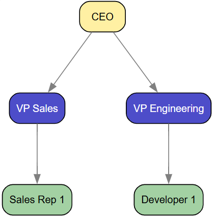
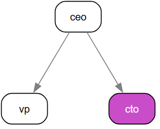
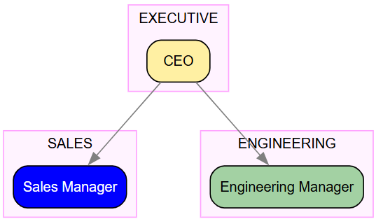
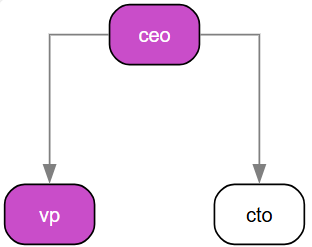
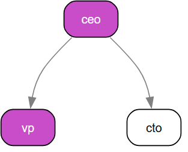
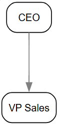
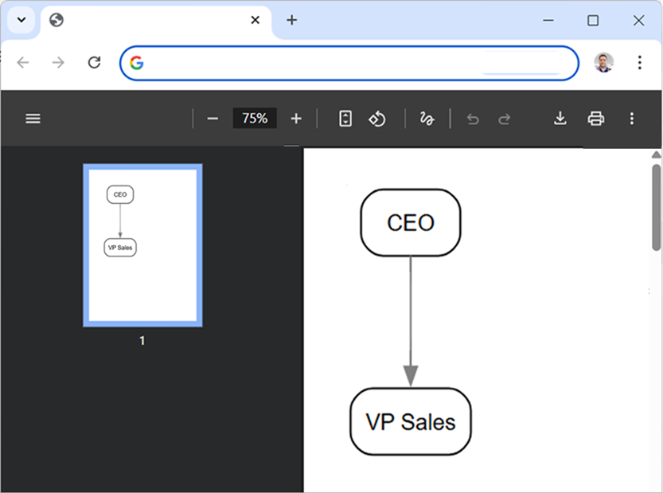
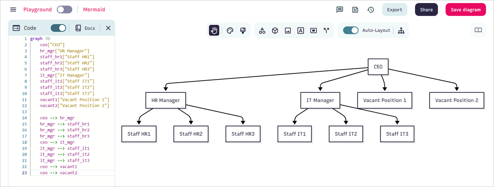

# Introducing stzOrgChart - The Strategic Organizational Intelligence Platform

In Softanza, understanding organizational structure transcends simple box-and-line diagrams. Organizations need dynamic tools that can model, analyze, and visualize their human infrastructure with precision and depth. Enter **stzOrgChart** – a revolutionary approach to organizational modeling that transforms static charts into living, analytical systems with governance-aware intelligence.

## The Foundation: Position, People, and Department Management

Let's start with the core building blocks. Creating an organizational hierarchy with **stzOrgChart** is both intuitive and powerful:

```ring
oOrg = new stzOrgChart("Basic_Hierarchy")
oOrg {
    SetLayout("TD")
    
    # Add executive position
    AddExecutivePositionXT(:ceo, "CEO") # ceo is the ID of the node and CEO it's label
    
    # Add management positions
    AddManagementPositionXT(:vp_sales, "VP Sales")
    AddManagementPositionXT(:vp_eng, "VP Engineering")
    
    # Set reporting lines
    ReportsTo(:vp_sales, :ceo)
    ReportsTo(:vp_eng, :ceo)
    
    # Add staff positions with attributes
    AddStaffPositionXTT(:sales_rep1, "Sales Rep 1", [:region = "North"])
    AddStaffPositionXTT(:dev1, "Developer 1", [:skill = "Backend"])
    
    ReportsTo(:sales_rep1, :vp_sales)
    ReportsTo(:dev1, :vp_eng)
    
    View()
}
```
Output:



Texecutive (yellow), management (blue), and staff positions (green), creating a visually intuitive hierarchy.

> **NOTE**: The colors and everything else are completely configurable, at the gloabl level, to cope with your taste and need, by simply editng this container at the beginning of the stzOrgChart.ring file:
```
$aOrgColors = [
    :board = "gold",
    :executive = "gold-",       # Lighter gold
    :management = "blue+",      # Mid-blue
    :staff = "green-",          # Green
    :operations = "blue",
    :treasury = "green",
    :risk = "orange",
    :audit = "purple",
    :hr = "pink",
    :it = "cyan",
    :sales = "blue",
    :engineering = "green-",
    
    :focus = "magenta+"
]
```


### People Management with Rich Data

The true power emerges when we add people to positions with rich attribute data:

```ring
oOrg = new stzOrgChart("People_Management")
oOrg {

    AddPosition("ceo")
    AddPosition("vp")
    AddPosition("cto")

    ReportsTo("vp", "ceo")
    ReportsTo("cto", "ceo")

    # Add people with data
    AddPersonXTT("p1", "John Doe", [:tenure = 5, :performance = "High"])
    AddPersonXT("p2", "Jane Smith")

    # Assign people to positions
    AssignPerson("p1", "ceo")
    AssignPerson("p2", "vp")

    # Verify assignments and data
    ? @@NL( People() )
    
    # View with people emphasized
    ViewPopulated()
}
```

Our org chart now is populated and we can check the data about it's people by checking the outpout of the People() method:
```
[
		[
			[ "id", "p1" ],
			[ "name", "John Doe" ],
			[ "position", "ceo" ],
			[
				"data",
				[
					[ "tenure", 5 ],
					[ "performance", "High" ]
				]
			]
		],
		[
			[ "id", "p2" ],
			[ "name", "Jane Smith" ],
			[ "position", "vp" ],
			[ "data", [  ] ]
		]
]
```

The `ViewPopulated()` method instantly shows, in a distinct color, the nodes of the org chart that are **populated** with persons ("ceo" and "vp") and those who are not (the "cto" node).


> **NOTE**: The magenta color used here to highlight the nodes containing people is configurable in the `$aOrgColors` global setting we saw earlier, in particular, by modifying the `:focus = "magenta+"` line.

Or you can focus on the **vacant** positions (nodes without people assigned to them) by using `ViewVacant()` instead of `ViewPopulated()` and so you get:



### Departmental Structure and Clusters

Organizations are naturally compartmentalized into departments, and **stzOrgChart** models this reality:

```ring
oOrg = new stzOrgChart("Department_Management")
oOrg {
    # Adding the positions and who reports to whom

    AddPositionXT(:ceo, "CEO")
    AddPositionXT(:sales_mgr, "Sales Manager")
    AddPositionXT(:eng_mgr, "Engineering Manager")

    ReportsTo(:sales_mgr, :ceo)
    ReportsTo(:eng_mgr, :ceo)

    # Adding departments and filling them with positions

    AddDepartmentXTT(:exec, "EXECUTIVE", [ :ceo ])
    AddDepartmentXTT(:sales, "SALES", [ :sales_mgr ])
    AddDepartmentXTT(:eng, "ENGINEERING", [ :eng_mgr ])

    # Set position departments
    SetPositionDepartment(:ceo, "EXECUTIVE")
    SetPositionDepartment(:sales_mgr, "SALES")
    SetPositionDepartment(:eng_mgr, "ENGINEERING")

    # Verify
    ? @@NL( Departments() ) + NL

    ? @@NL( Department("SALES") )

    ViewByDepartment()
}
```
The full content of the departments is returned using `Departments()`method:

And you can call the data of just a given department using `Department(cName)` like in `Department("SALES")` above.

Finally, these departments are automatically reflected on the visual org chart as three **clusters**, each containing all the nodes assigned to that department. Each cluster appears as a box that encloses the department’s nodes:



> **NOTE**: If the default magenta cluster color isn’t what you prefer, you can change it effortlessly. Just add a line such as `SetClusterColor("gray")` before calling `View()`, and the new color will be applied to all clusters.

You can also set the **default** cluster color globally by editing the `stzDiagram.ring` file and assigning:

```
$cDefaultClusterColor = "gray"
```

(This will apply the color automatically to all future org charts unless overridden in code.)


## The Unified Validation System: Two-Level Intelligence

One of **stzOrgChart**'s most powerful features is its unified validation system, providing both high-level compliance checks and granular node-level analysis. This dual-level approach serves different needs: executives want quick yes/no answers, while analysts need detailed reports with specific problem nodes identified.

### Level 1: Boolean Validation (Whole-Organization)

For rapid compliance checks, use `IsValid()` to get immediate boolean answers:

```ring
oOrg = new stzOrgChart("Regional_Bank")
oOrg {
    # ... build structure ...
    
    # Quick compliance checks
    ? "BCEAO compliant? " + IsValid(:BCEAO)           #--> FALSE
    ? "Span of control OK? " + IsValid(:SOC)          #--> TRUE
    ? "Succession planning adequate? " + IsValid(:Succession)  #--> FALSE
    ? "Vacancies acceptable? " + IsValid(:Vacancy)    #--> FALSE
}
```

This is perfect for dashboards, automated alerts, or executive summaries where you need instant "red light / green light" indicators.

### Level 2: Detailed Validation (Node-Level Analysis)

When you need to understand *what's wrong* and *where*, use `Validate()` to get comprehensive reports:

```ring
oOrg {
    # Detailed validation report
    ? @@NL( Validate(:BCEAO) )
}
```

Output:
```ring
[
    [ "status", "fail" ],
    [ "domain", "BCEAO_governance" ],
    [ "issueCount", 2 ],
    [
        "issues",
        [
            "BCEAO-001: No Board of Directors found",
            "BCEAO-003: No dedicated Risk Management function"
        ]
    ],
    [ "affectedNodes", [ "audit_head" ] ]
]
```

The **`affectedNodes`** field is crucial—it enables visual highlighting of problematic positions in the org chart.

### Built-in Validators

**stzOrgChart** comes with comprehensive validators out of the box:

| Validator | Purpose | Typical Use Case |
|-----------|---------|------------------|
| `:BCEAO` | West African Central Bank governance | Financial institutions |
| `:SOC` / `:SpanOfControl` | Manager overload detection | All organizations |
| `:SOD` / `:SegregationOfDuties` | Conflict of interest prevention | Banking, finance |
| `:Vacancy` | Staffing gap analysis | HR planning |
| `:Succession` | Continuity risk assessment | Executive planning |
| `:Summary` | All validators combined | Comprehensive audit |

### Visual Validation: Seeing Problems in Context

The real magic happens when you combine validation with visualization. Every validator's `affectedNodes` output can be used to highlight problems directly in the org chart:

```ring
oOrg {
    # Show vacant positions in red
    ViewVacant()
    
    # Highlight succession risks
    ViewAtRisk()
    
    # Show non-compliant nodes
    ViewNonCompliant(:BCEAO)
    
    # Or show compliant nodes instead
    ViewCompliant(:SOC)
}
```

Each view method uses the validator's output to apply the focus color (default: magenta) to affected nodes, making problems immediately visible in organizational context.

### Validation Summary: The Complete Picture

For comprehensive audits, use the summary validator:

```ring
oOrg {
    aSummary = Validate(:Summary)
    ? @@NL( aSummary )
}
```

Output:
```ring
[
    [ "status", "fail" ],
    [ "domain", "summary" ],
    [ "validatorsRun", 5 ],
    [ "validatorsFailed", 3 ],
    [ "totalIssues", 8 ],
    [
        "results",
        [
            # Individual validator results...
        ]
    ],
    [ "affectedNodes", [ "board", "audit_head", "ceo", "cfo", "ops_mgr" ] ]
]
```

This gives you:
- Overall pass/fail status
- Number of validators run vs failed
- Total issue count across all validators
- Complete list of all affected positions
- Detailed results from each validator

### Custom Validators: Extending the System

The validation system is designed for extension. Add your own validators by following the naming convention:

```ring
class stzOrgChart
    # Your custom validator
    def ValidateMyCustomRule()
        aIssues = []
        acAffected = []
        
        # Your validation logic...
        if someCondition
            aIssues + "CUSTOM-001: Issue description"
            acAffected + "problem_node_id"
        ok
        
        return [
            :status = iif(len(aIssues) = 0, "pass", "fail"),
            :domain = "my_custom_rule",
            :issueCount = len(aIssues),
            :issues = aIssues,
            :affectedNodes = acAffected
        ]
    ok
ok
```

Once defined, it automatically integrates:

```ring
oOrg {
    ? IsValid(:MyCustomRule)              # Boolean check
    ? @@NL( Validate(:MyCustomRule) )     # Detailed report
    ViewNonCompliant(:MyCustomRule)       # Visual highlighting
}
```

### Real-World Example: Banking Compliance

Here's how a regional bank might use the validation system:

```ring
oBankOrg = new stzOrgChart("Regional_Bank_Governance")
oBankOrg {
    # Build structure...
    AddExecutivePositionXT("board", "Board of Directors")
    AddExecutivePositionXT("ceo", "CEO")
    AddManagementPositionXT("cfo", "CFO")
    AddManagementPositionXT("cro", "Chief Risk Officer")
    AddManagementPositionXT("cao", "Chief Audit Officer")
    
    ReportsTo("ceo", "board")
    ReportsTo("cfo", "ceo")
    ReportsTo("cro", "ceo")
    ReportsTo("cao", "board")  # Audit reports to board (BCEAO requirement)
    
    SetPositionDepartment("cao", "audit")
    SetPositionDepartment("cro", "risk")
    
    # Compliance check
    ? BoxRound("REGULATORY COMPLIANCE CHECK")
    
    if IsValid(:BCEAO)
        ? "✓ BCEAO governance compliant"
    else
        ? "✗ BCEAO governance issues found:"
        aBCEAO = Validate(:BCEAO)
        for issue in aBCEAO[:issues]
            ? "  • " + issue
        next
        
        # Visual inspection
        ViewNonCompliant(:BCEAO)
    ok
}
```

This approach transforms compliance from a checkbox exercise into a strategic tool that:
- **Prevents** issues through structural validation
- **Detects** problems before audits
- **Visualizes** organizational weaknesses
- **Documents** compliance status with evidence

The validation system scales from startup governance to enterprise compliance, making **stzOrgChart** not just a diagramming tool, but a strategic organizational intelligence platform.

## Simulation and Scenario Planning

Perhaps the most strategic feature of **stzOrgChart** is its ability to simulate organizational changes before implementing them in reality:

```ring
# Create baseline snapshot
? CreateSnapshot("Initial")

# Define reorganization changes
aChanges = [
    [:type = "change_reporting", :subordinate = "vp2", :supervisor = "vp1"],
    [:type = "add_position", :id = "new_pos", :title = "New Position"],
    [:type = "remove_position", :position = "vp1"]
]

# Analyze impact
? SimulateReorganization(aChanges)
```

The simulation engine quantitatively analyzes the impact of proposed changes on key organizational metrics:

```ring
[
    [
        "before",
        [
            [ "spanofcontrol", 2 ],
            [ "vacancyrate", 100 ]
        ]
    ],
    [
        "after",
        [
            [ "spanofcontrol", 0 ],
            [ "vacancyrate", 100 ]
        ]
    ],
    # Detailed changes applied
]
```

This enables data-driven decision making for restructuring initiatives, merger integrations, and strategic realignments.


## Technical Power: Graph Theory Meets Business Intelligence

Under the hood, **stzOrgChart** leverages advanced **graph theory** algorithms inherited from its parent class `stzGraph`.

These capabilities enable sophisticated analyses like:
- Identifying communication bottlenecks that slow decision-making
- Detecting single points of failure in critical functions
- Optimizing organizational depth to balance control and agility
- Quantifying influence networks beyond formal reporting lines

Let's see some of them by example :

```ring
oOrg = new stzOrgChart("Graph_Analysis")
oOrg {

    AddPosition("a")
    AddPosition("b")
    AddPosition("c")
    AddPosition("d")
    AddPosition("e")

    ReportsTo("b", "a")
    ReportsTo("c", "b")
    ReportsTo("d", "c")
    ReportsTo("e", "a")  # Parallel branch

    # Cyclic check (no cycle)
    ? CyclicDependencies()  # FALSE

    # Add cycle
    ReportsTo("a", "d")  # Creates cycle a->b->c->d->a
    ? CyclicDependencies()  # TRUE

    # Remove cycle for further tests
    Disconnect("a", "d")
    ? CyclicDependencies()  #--> FALSE

    # Connected components
    ? @@( ConnectedComponents() )  # [["a", "b", "c", "d", "e"]]

    # Articulation points (removal increases components)
    ? @@( ArticulationPoints() ) #--> [ "a", "d" ]

    # Betweenness centrality
    ? BetweennessCentrality("b")  #--> 0.25

    # Closeness centrality
    ? ClosenessCentrality("a")  #--> 0.57

    # Diameter (longest shortest path)
    ? Diameter()  #--> 4

    # Average path length
    ? AveragePathLength() #--> 2

    # Clustering coefficient
    ? ClusteringCoefficient("a")  #--> 0 Low since branches don't connect

}
```

>**NOTE**: To get a detailed idea about the powerful features you can get for stzGraph, right inside your `stzOrgChart` objects, read [this article](../narrations/stzGraphDoc.md).

## 11. Rule-Based Programming in stzOrgChart

Because `stzOrgChart` inherits directly from `stzGraph`, it has access to the complete Softanza **rule engine** — one of the sophisticated features in the library.

Rules transform a static org chart into a **live, self-validating governance system**. You encode your organization's policies once, and the chart continuously monitors itself.

```ring
oOrg = new stzOrgChart("RuleGoverned")
oOrg {

    # Only one root allowed
    When( len(DependencyFreeNodes()) > 1 )
        AddAnomaly("ORG-001: Multiple root nodes – only Board or CEO may be root")

    # BCEAO/Basel III – Risk Officer must report directly to Board or CEO
    WhenNodeExists("dir_risk")
        if not ( ReportsDirectlyTo("dir_risk", "board") or ReportsDirectlyTo("dir_risk", "ceo") )
            AddAnomaly("RISK-001: Chief Risk Officer must report to Board or CEO")
        ok

    # Internal HR policy – every manager must have at least 3 direct reports
    WhenNodeHasAttribute(:level, "management")
        if NumberOfDirectReports( This.CurrentNode() ) < 3
            AddAnomaly("HR-012: Manager " + This.CurrentNode() + " has insufficient span of control")
        ok

    # Sales department minimum staffing policy
    WhenDepartmentExists("Sales")
        if PositionsInDepartment("Sales").len() < 6
            AddAnomaly("SALES-001: Sales department below minimum required headcount")
        ok

    # Show results
    ? "CUSTOM RULE Anomalies:"
    ? @@NL( Anomalies() )
    ShowAnomalies()   # highlights offending nodes in red
}
```

Rules are evaluated instantly after every structural change. They perfectly complement the built-in `Validate(:BCEAO)`, `Validate(:SpanOfControl)`, etc., giving you unlimited **domain-specific** governance.

## 12. Knowledge-Oriented Programming (KOP) With stzOrgChart

By combining `stzOrgChart` with `stzKnowledgeGraph` classes, yet an other powerful class of the Softanza Graph Module, the organizational structure becomes a full **semantic knowledge engine** you can query in near-natural business language.

```ring
oKG = new stzKnowledgeGraph("BankSemantics")
oKG {

    # Facts derived from the org chart (can be auto-generated in future versions) #TODO Make them now!
    AddFact("ceo",       :IsA,         "ExecutivePosition")
    AddFact("dir_risk",  :IsA,         "ControlFunction")
    AddFact("vp_sales",  :ReportsTo,   "ceo")
    AddFact("vp_sales",  :InDepartment,"Sales")
    AddFact("vp_sales",  :Criticality, "High")
    AddFact("p_fatou",   :Holds,       "vp_sales")
    AddFact("p_fatou",   :HasSkill,    "RevenueGrowth")
    AddFact("p_fatou",   :Tenure,      8)

    # Ontology
    DefineClass("ControlFunction", "Position")
    DefineClass("ExecutivePosition", "Position")

    # Business-oriented queries
    ? "Who reports directly to the CEO?"
    ? @@( Query(["?who", :ReportsTo, "ceo"]) )

    ? "Which positions are Control Functions?"
    ? @@( Query(["?pos", :IsA, "ControlFunction"]) )

    ? "Who has tenure > 5 years and holds a critical role?"
    ? @@( Query(["?person", :Tenure, "?years"]) )   # then filter in Ring if needed

    ? "Roles similar to VP Sales (shared predicates)"
    ? @@NL( SimilarTo("vp_sales") )
}
```

The fusion of structural graph + semantic triples delivers **hybrid intelligence**: graph algorithms reveal bottlenecks, KOP explains _why_ they matter from a business perspective.


# Visual Plasticity: Configuring the OrgChart Appearance

Most of the smart defaults provided by **stzOrgChart** are already optimized for clarity and consistency, and in many cases you won’t need to change anything. Still, *every aspect is customizable*—either at the **stzOrgChart** level or at its parent class **stzDiagram**, which provides a rich visual foundation.

As demonstrated earlier, you can customize global values such as:

* The list of organizational colors via the global `$aOrgColors`
* The default cluster color via `$cDefaultClusterColor`
* And many additional visual parameters

We also saw how to apply a **specific cluster color** only to the current org chart using `SetClusterColor()`. Following the same approach, you can personalize many other visual aspects:

* `SetEdgeColor("blue-")`
* `SetLayout(:LeftRight)`
* …and more.

### Choosing the spline style (edge style)

You can also choose the type of splines (edge drawing style) to use:

* `SetSplines("ortho")` – orthogonal step-like connectors
* `SetSplines("splines")` – smooth direct arrows (the default style used in previous visuals)
* Other options include: `"line"`, `"polyline"`, `"curved"`, etc.

### Example: Switching to Orthogonal Splines

Here is one of our previous examples, revisited to use the **orthogonal** spline style:

```ring
oOrg = new stzOrgChart("People_Management")
oOrg {

    SetSplines("ortho")   # Other options: splines, line, polyline, curved, etc.

    AddPosition("ceo")
    AddPosition("vp")
    AddPosition("cto")

    ReportsTo("vp", "ceo")
    ReportsTo("cto", "ceo")

    # Add people with data
    AddPersonXTT("p1", "John Doe", [:tenure = 5, :performance = "High"])
    AddPersonXT("p2", "Jane Smith")

    # Assign people to positions
    AssignPerson("p1", "ceo")
    AssignPerson("p2", "vp")

    # Verify assignments and data
    ? @@NL( People() )
    
    # View with people emphasized
    ViewPopulated()
}
```

The org chart now turns **orthogonal**:



Switch to:

```ring
SetSplines("curved")
```

and you get a **curved** connector style:



### Beyond These Options

These examples represent only a small portion of what’s possible, because **stzOrgChart** inherits all customization capabilities from the powerful **stzDiagram** class.

Anything you can visually configure in **stzDiagram** can also be applied directly to **stzOrgChart**.

For more information on the `stzDiagram` class, refer to the dedicated article: **#TODO**

## Business User Accessibility: Beyond Programming

**stzOrgChart** bridges the gap between technical and business users through its dedicated `.stzorg` file format. Business users can edit organizational structures **directly in text files** without writing code:

```text
orgchart "Banking Structure"

positions
    ceo
        title: CEO
        level: executive
        department: executive
        reportsTo: board

    vp_sales
        title: VP Sales
        level: management
        department: sales
        reportsTo: ceo

people
    p1
        name: Ali Mamane
        data: {tenure: 5, performance: "High"}
        
    p2
        name: Salimatou Touré

assignments
    p1 -> ceo
    p2 -> vp_sales

departments
    sales
        name: Sales Department
        positions: ["vp_sales", "sales_mgr1", "sales_mgr2"]
```

Loading this structure from the text file and visualizing it requires minimal code:

```ring
oOrgChart = new stzOrgChart("Imported_Org")
oOrgChart {
    Import("banking_structure.stzorg")
    View()
}
```


Now, all the `stzOrgChart` features are accessible by code, and you can edit the text file again to change the org chart structure, and then load it again. This accessibility makes organizational intelligence available to all stakeholders, not just technical teams.


## Generating your Org Chart File

**stzOrgChart** can generate your organizational chart in multiple formats—images (PNG, JPEG), vector files (SVG, PDF), and any other format supported by the Graphviz DOT engine used internally to render the graph.

Exporting is as simple as calling `SetOutput(cFormat)`:

```ring
oOrgChart = new stzOrgChart("Imported_Org")
oOrgChart {
    Import("banking_structure.stzorg")
    SetOutput("PDF") # SVG is the default form.
    View()
}

```

This produces a PDF file that opens automatically in your browser or your system’s default PDF viewer:



In practice, you can choose your export format based on your needs:

* **SVG** — Ideal for interactive web applications and scalable visuals
* **PDF** — Best for formal documents, reports, and printing
* **PNG or other bitmap formats** — Useful for presentations, slides, and email sharing

### Exporing the orgchart

Mermaid and others


## Softanza Advantage: Why stzOrgChart Outperforms the Competition

The landscape of organizational charting tools is crowded with solutions that focus primarily on visualization. However, **stzOrgChart** stands apart by delivering a complete organizational intelligence platform that integrates governance, analytics, and simulation capabilities in a uniquely accessible architecture. The following comparison demonstrates why Softanza's approach represents the future of organizational design:

| Feature Category | Softanza **stzOrgChart** (Ring) | D3.js/OrgChart JS (JavaScript) | Visio/Lucidchart (GUI Tools) | NetworkX (Python) | Enterprise HRIS Platforms |
|-----------------|--------------------------------|--------------------------------|------------------------------|-------------------|---------------------------|
| **Core Architecture** | Layered system (stzGraph; stzKnwoledgeGraph, stzDiagram, stzOrgChart) with analytical rulebased dimensions | Visualization-focused libraries with limited analytics | Static diagramming with minimal data integration | Graph algorithms without business context | Monolithic systems with rigid structures |
| **Governance Validation** | ✅ Built-in frameworks (BCEAO, SOX, ISO) with automatic issue detection | ❌ Manual implementation required | ⚠️ Visual templates only, no validation logic | ❌ Requires custom implementation | ✅ Pre-built compliance but inflexible and costly |
| **Simulation Engine** | ✅ Quantitative impact analysis of org changes with metric tracking | ❌ No native capabilities | ❌ No simulation capabilities | ⚠️ Possible with custom code, no business context | ⚠️ Limited scenario modeling at high cost |
| **Analysis Layers** | ✅ Performance, Risk, Compliance, Succession layers with toggle capability | ❌ Single-dimension visualization | ❌ No layered analytics | ❌ Requires complex integration | ⚠️ Separate modules that don't integrate well |
| **Data Integration** | ✅ Unified model combining positions, people, departments, and attributes | ⚠️ Requires external data binding | ⚠️ Limited data capabilities | ✅ Strong data handling but weak visualization | ✅ Comprehensive data but poor visualization |
| **User Accessibility** | ✅ Business-friendly `.stzorg` format + programmer API | ❌ Code-intensive for non-developers | ✅ Drag-and-drop interface but limited analytics | ❌ Requires programming expertise | ✅ Business interface but limited customization |
| **Graph Analytics** | ✅ Built-in centrality, connectivity, and cycle detection | ⚠️ Possible with extensions | ❌ No native graph algorithms | ✅ Rich algorithm library but visualization challenges | ❌ Limited or no graph theory implementation |
| **Deployment Model** | ✅ Desktop, web, or embedded in enterprise applications | ✅ Web-focused only | ⚠️ Cloud or desktop with limitations | ✅ Research/analysis environment | ❌ Cloud-only with vendor lock-in |
| **Customization** | ✅ Open architecture with extensible rule system | ✅ Developer-customizable but complex | ❌ Limited to vendor-provided features | ✅ Highly customizable but steep learning curve | ❌ Minimal customization without expensive services |
| **Total Cost of Ownership** | ✅ One-time development with no recurring fees | ✅ Free libraries but high development cost | ⚠️ Subscription fees with limited functionality | ✅ Free but requires specialized skills | ❌ $50K-$500K+ implementation with annual fees |
| **Time to Value** | ✅ Days to weeks for complete implementation | ⚠️ Weeks to months for full solution | ✅ Hours for basic charts, months for analytics | ⚠️ Months for non-technical teams | ❌ 6-18 months implementation cycles |

**Key Differentiators That Matter**

- **The Integrated Intelligence Approach**: Unlike visualization-only tools (D3.js, Visio), **stzOrgChart** treats organizational structure as a living analytical system. It allows leaders to toggle between compliance views, risk heatmaps, and succession planning perspectives without rebuilding charts from scratch.

- **Governance as Code**: While enterprise HRIS platforms bury compliance rules in configuration menus, **stzOrgChart** exposes governance standards as programmable validations. This enables version control, automated testing, and continuous compliance monitoring—capabilities unavailable in static diagramming tools.

- **Simulation-First Mindset**: Most organizational tools present a snapshot in time. **stzOrgChart**'s simulation engine quantifies the impact of proposed changes on span of control, vacancy rates, and risk exposure before decisions are made—turning reorganization from guesswork into engineering.

- **Business-Technical Bridge**: The `.stzorg` file format eliminates the traditional divide between business analysts and developers. HR professionals can edit organizational structures in plain text while developers build sophisticated analytics on the same foundation—a duality impossible in pure GUI tools or academic graph libraries.

- **Total Ownership Cost**: Enterprise platforms charge premium prices for features that **stzOrgChart** delivers with elegant simplicity. Organizations avoid vendor lock-in while maintaining complete control over their organizational data and intelligence workflows.

This isn't just organizational charting—it's organizational engineering with full strategic ownership.

## Conclusion: The Strategic Value of Organizational Intelligence

**stzOrgChart** represents far more than a diagramming tool—it's a strategic intelligence platform that transforms how organizations understand and optimize their human infrastructure. By integrating graph theory, governance frameworks, simulation capabilities, and multi-dimensional visualization, **stzOrgChart** enables leaders to:

- **Quantify organizational health** through validated metrics rather than intuition
- **Simulate restructuring impacts** before committing resources to change
- **Identify hidden risks** in reporting structures and succession planning
- **Ensure regulatory compliance** through automated governance validation
- **Optimize decision-making velocity** by analyzing communication pathways
- **Visualize complex relationships** through layered analytical perspectives

Whether you're an HR executive evaluating talent pipelines, a compliance officer ensuring regulatory adherence, a restructuring consultant optimizing spans of control, or a CEO planning digital transformation, **stzOrgChart** provides the analytical foundation for making confident, data-driven decisions about your organization's most valuable asset—your people.