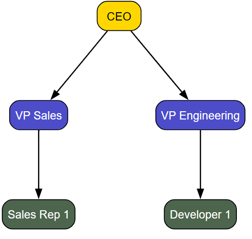
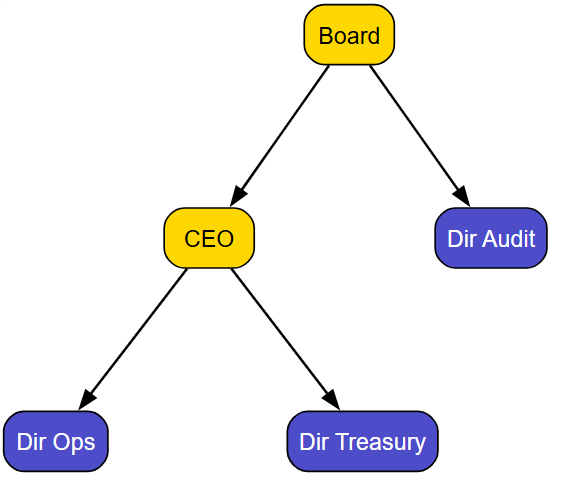
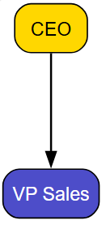

# Introducing stzOrgChart - The tool for Organizational Modeling and Intelligence

In Softanza, understanding organizational structure is no longer just about drawing boxes and lines. Organizations need dynamic tools that can model, analyze, and visualize their human infrastructure with the same sophistication used for geographic information systems. Enter **stzOrgChart** – a revolutionary approach to organizational modeling that transforms static charts into living, analytical systems.

Built on the powerful foundation of Softanza's Graph Module for Ring programming language, stzOrgChart transcends traditional organizational charting by adopting a layered architecture reminiscent of GIS systems. Like GIS overlays that add demographic, environmental, or economic data to base maps, stzOrgChart allows organizations to visualize multiple analytical dimensions atop their structural foundation.

It's designed to make it easy to model, analyze, audit and query organizational structures for both programmers and business users.

## The Foundation: More Than Just Boxes and Lines

Let's start with the basics. Creating an organizational hierarchy with stzOrgChart is intuitive yet powerful:

```ring
oOrg = new stzOrgChart("Basic_Hierarchy")
oOrg {

    SetLayout("TD")
    
    # Add executive position
    AddExecutivePositionXT("ceo", "CEO")
    
    # Add management positions
    AddManagementPositionXT("vp_sales", "VP Sales")
    AddManagementPositionXT("vp_eng", "VP Engineering")
    
    # Set reporting lines
    ReportsTo("vp_sales", "ceo")
    ReportsTo("vp_eng", "ceo")
    
    # Add staff positions with attributes
    AddStaffPositionXTT("sales_rep1", "Sales Rep 1", [:region = "North"])
    AddStaffPositionXTT("dev1", "Developer 1", [:skill = "Backend"])
    
    ReportsTo("sales_rep1", "vp_sales")
    ReportsTo("dev1", "vp_eng")
    
    View()
}
```
Output:



This simple example demonstrates how stzOrgChart automatically differentiates between executive (gold), management (blue), and staff positions (green), creating a visually intuitive hierarchy. But the real power emerges when we add people to these positions:

```ring
oOrg = new stzOrgChart("People_Management")
oOrg {
    AddPositionXT("ceo", "CEO")
    AddPositionXT("vp", "VP")
    
    # Add people with data
    AddPersonXTT("p1", "John Doe", [:tenure = 5, :performance = "High"])
    AddPersonXT("p2", "Jane Smith")
    
    # Assign people
    AssignPerson("p1", "ceo")
    AssignPerson("p2", "vp")
    
    ViewWithPeople()
}
```

The `ViewWithPeople()` method instantly transforms our chart to display both position titles and incumbent names, while preserving all the people data (tenure, performance metrics) behind the scenes.

## Layered Intelligence: The GIS-like Approach to Org Charts

The most innovative aspect of stzOrgChart is its analytical layering system. Drawing inspiration from Geographic Information Systems (GIS), stzOrgChart allows organizations to visualize multiple dimensions of intelligence overlaid on the base organizational structure. These analytical layers include:

1. **Performance Layer** - Visualizes performance metrics across the organization, highlighting high performers and potential performance gaps.
2. **Risk Layer** - Identifies positions with high operational, compliance, or continuity risk.
3. **Compliance Layer** - Ensures governance standards are maintained throughout the organization.
4. **Succession Layer** - Maps critical positions and their succession readiness status.

Each layer can be applied individually or in combination, allowing leaders to toggle between different analytical perspectives without rebuilding the organizational chart:

```ring
oOrg = new stzOrgChart("Analysis_Layers")
oOrg {

    AddPositionXT("ceo", "CEO")
    AddPositionXT("vp", "VP")
    ReportsTo("vp", "ceo")
    
    # Add layers
    oPerformance = AddAnalysisLayer("Performance", "performance")
    oRisk = AddAnalysisLayer("Risk", "risk")
    oCompliance = AddAnalysisLayer("Compliance", "compliance")
    oSuccession = AddAnalysisLayer("Succession", "succession")
    
    # Apply individually and all
    ApplyLayer("Performance")
    ApplyAllLayers()
    View()
}
```

This layered approach means HR professionals can instantly switch between viewing performance metrics and succession risks, while compliance officers can toggle between governance checks and segregation of duties analysis—all on the same organizational foundation.

## Governance, Compliance, and Risk Analysis

Modern organizations face increasingly complex governance requirements. stzOrgChart addresses this with built-in validation frameworks that check critical governance standards:

```ring
oOrg = new stzOrgChart("Validation_Compliance")
oOrg {

    AddExecutivePositionXT("board", "Board")
    AddExecutivePositionXT("ceo", "CEO")

    ReportsTo("ceo", "board")

    AddManagementPositionXT("dir_audit", "Dir Audit")
    ReportsTo("dir_audit", "board")  # Compliant

    AddManagementPositionXT("dir_ops", "Dir Ops")
    AddManagementPositionXT("dir_treasury", "Dir Treasury")

    ReportsTo("dir_ops", "ceo")  # Should not report to treasury for SOD
    ReportsTo("dir_treasury", "ceo")

    # Validate

    ? @@Nl( ValidateBCEAOGovernance() )

    ? @@NL( ValidateSpanOfControl() )

    ? @@NL( ValidateSegregationOfDuties() )

    View()
}
```

The system automatically flags governance issues like audit function independence and segregation of duties violations, turning compliance from a manual checklist exercise into an integrated analytical process.

Output of BCEAO Banking Governance validation:
```
[
	[ "status", "fail" ],
	[ "domain", "BCEAO_governance" ],
	[ "issuecount", 1 ],
	[
		"issues",
		[
			"BCEAO-003: No dedicated Risk Management function"
		]
	]
]
```
Output of SOC validation (Span Of Control):
```
[
	[ "status", "pass" ],
	[ "domain", "span_of_control" ],
	[ "issues", [  ] ]
]
```
Output of the Segregation of Duuty validation:
```
[
	[ "status", "pass" ],
	[ "domain", "segregation_of_duties" ],
	[ "issuecount", 0 ],
	[ "issues", [  ] ]
]
```

the `View()` method generates this visual:




## Comprehensive Reporting: From Data to Decisions

`stzOrgChart` transforms raw organizational data into actionable insights through comprehensive reporting:

```ring
// Add these lines to the sample of the previous section

# Generate reports
? GenerateReport("summary")
? GenerateReport("vacancies")
? GenerateReport("succession")
? GenerateReport("compliance")
? GenerateReport("span")
```

Each report type provides targeted insights. The succession report identifies critical positions without ready successors, the compliance report highlights governance gaps, and the span of control analysis optimizes management structures.

The vacancy report, for example, doesn't just count open positions—it contextualizes them by department, level, and title, enabling targeted recruitment strategies:

```
[
    [ "title", "Vacancy Report" ],
    [ "vacancycount", 7 ],
    [ "vacancyrate", 87.50 ],
    [
        "details",
        [
            [
                [ "position", "mgr1" ],
                [ "title", "Manager 1" ],
                [ "department", "" ],
                [ "level", "management" ]
            ],
            # ... additional positions ...
        ]
    ]
]
```

## Simulation and Scenario Planning

Perhaps the most powerful feature is `stzOrgChart`'s ability to simulate organizational changes before implementing them:

```ring
// Add the fellwoing codeto the previous one

# Create snapshot
? CreateSnapshot("Initial")

# Simulate changes
aChanges = [
    [:type = "change_reporting", :subordinate = "vp2", :supervisor = "vp1"],
    [:type = "add_position", :id = "new_pos", :title = "New Position"],
    [:type = "remove_position", :position = "vp1"]
]

? SimulateReorganization(aChanges)
```

You start by taking a snapshot of the current orgchart state to serve as a baseline to your simulation:
```
# Current state of your orgchart system
[
	[ "id", "Initial" ],
	[ "date", "25/11/2025" ],
	[
		"positions",
		[
			[
				[ "id", "board" ],
				[ "title", "Board" ],
				[ "level", 0 ],
				[ "department", "" ],
				[ "reportsto", "" ],
				[ "incumbent", "" ],
				[ "isvacant", 1 ],
				[
					"attributes",
					[
						[ "level", "executive" ]
					]
				]
			],
			[
				[ "id", "ceo" ],
				[ "title", "CEO" ],
				[ "level", 0 ],
				[ "department", "" ],
				[ "reportsto", "board" ],
				[ "incumbent", "" ],
				[ "isvacant", 1 ],
				[
					"attributes",
					[
						[ "level", "executive" ]
					]
				]
			],
			[
				[ "id", "dir_audit" ],
				[ "title", "Dir Audit" ],
				[ "level", 0 ],
				[ "department", "" ],
				[ "reportsto", "board" ],
				[ "incumbent", "" ],
				[ "isvacant", 1 ],
				[
					"attributes",
					[
						[ "level", "management" ]
					]
				]
			],
			[
				[ "id", "dir_ops" ],
				[ "title", "Dir Ops" ],
				[ "level", 0 ],
				[ "department", "" ],
				[ "reportsto", "ceo" ],
				[ "incumbent", "" ],
				[ "isvacant", 1 ],
				[
					"attributes",
					[
						[ "level", "management" ]
					]
				]
			],
			[
				[ "id", "dir_treasury" ],
				[ "title", "Dir Treasury" ],
				[ "level", 0 ],
				[ "department", "" ],
				[ "reportsto", "ceo" ],
				[ "incumbent", "" ],
				[ "isvacant", 1 ],
				[
					"attributes",
					[
						[ "level", "management" ]
					]
				]
			]
		]
	],
	[ "people", [  ] ],
	[ "departments", [  ] ]
]
```

The simulation engine then analyzes the impact of proposed changes on key metrics like span of control and vacancy rates, providing quantitative evidence to support restructuring decisions.

```
# Output of the simulation
[
	[
		"before",
		[
			[ "spanofcontrol", 2 ],
			[ "vacancyrate", 100 ]
		]
	],
	[
		"after",
		[
			[ "spanofcontrol", 2 ],
			[ "vacancyrate", 100 ]
		]
	],
	[
		"changes",
		[
			[
				[ "type", "change_reporting" ],
				[ "subordinate", "vp2" ],
				[ "supervisor", "vp1" ]
			],
			[
				[ "type", "add_position" ],
				[ "id", "new_pos" ],
				[ "title", "New Position" ]
			],
			[
				[ "type", "remove_position" ],
				[ "position", "vp1" ]
			]
		]
	]
]
```

This enables powerful programmatin and datadriven what-if scenarios to let you build organizatuional projecttions ofr tactical and startegic decisions.

## Advanced Visualization: Making Complexity Clear

`stzOrgChart` offers multiple visualization perspectives tailored to different stakeholder needs:

```ring
oOrg = new stzOrgChart("Visualization")
oOrg {
    // Same code that constrtucts the orgchart from the previous sections
   
    ColorByDepartment()
    
    # Highlight path with a specif visual sign
    HighlightPath("staff1", "ceo")
    
    # Different views for the visual output
    ViewWithPeople()
    ViewVacancies()
    ViewByDepartment()
}
```

The `ViewByDepartment()` method reorganizes the visualization to emphasize departmental boundaries, while `ViewVacancies()` highlights unfilled positions. These perspective shifts help different stakeholders understand the organization through their specific lens.

## Technical Power: Graph Theory Meets Business Intelligence

Under the hood, `stzOrgChart` leverages advanced graph theory algorithms inherited from its parent classe `stzGraph`:

```ring
oOrg = new stzOrgChart("Graph_Traversal")
oOrg {
    AddPositionXT("a", "A")
    AddPositionXT("b", "B")
    AddPositionXT("c", "C")
    AddPositionXT("d", "D")
    AddPositionXT("e", "E")

    ReportsTo("b", "a")
    ReportsTo("c", "b")
    ReportsTo("d", "c")
    ReportsTo("e", "a")  # Parallel branch

    # Cyclic check (no cycle)
    ? CyclicDependencies()  #--> FALSE

    # Add cycle
    ReportsTo("a", "d")  # Creates cycle a->b->c->d->a
    ? CyclicDependencies()  #--> TRUE

    # Remove cycle for further tests
    Disconnect("a", "d")
    ? CyclicDependencies()  #--> FALSE

    # Connected components
    ? @@( ConnectedComponents() )  #--> [["a", "b", "c", "d", "e"]] if connected

    # Articulation points (removal increases components)
    ? @@( ArticulationPoints() ) #--> ["a", "b", "c"]

    # Betweenness centrality
    ? BetweennessCentrality("b")  #--> High for b

    # Closeness centrality
    ? ClosenessCentrality("a")  #--> High for root

    # Diameter (longest shortest path)
    ? Diameter()  #--> 3 (a to d)

    # Average path length
    ? AveragePathLength()

    # Clustering coefficient
    ? ClusteringCoefficient("a")  #--> Low since branches don't connect
}
```

These capabilities enable sophisticated analyses like identifying critical communication bottlenecks or potential single points of failure in organizational structures.

## Designed for Everyone not Only Programmers

`stzOrgChart` bridges the gap between technical and business users. Business people can work dircectly in text files and get their orgcharts generated without any line of code (other then loading the text file to the `stzOrgChart` object and calling the View() method)! 
```
# Example of a *.stzorg file the user can edit on NotePad or any text editot

orgchart "Export_Import_Test"

positions
    ceo
        title: CEO
        level: 0
        department: 
        reportsTo: 

    vp_sales
        title: VP Sales
        level: 0
        department: 
        reportsTo: ceo

people
    p1
        name: John Doe

    p2
        name: Jane Smith

assignments
    p1 -> ceo
    p2 -> vp_sales

departments
    sales
        name: Sales Dept
        positions: [ "vp_sales" ]

```

Code we need to write inorder to load the orgchart description file, assuming it has been saved as `teststzorg`:
```
oOrgChart = new stzOrgChart("Imported_Org")
oOrgChart {
	Import("test.stzorg")
	View()
}
```
Outpout:


> **NOTE**: In practice, programmers would use Ring and Softanza to develop a GUI application (desktop or web) to make it easy to business users to edit the orchart content in a grid and generate the visual by a click of a button.
> 
## A Complete Example

Let's bring what we saw toegother in a realistic orgchar to see the unified experience Softanza offers:
```
oOrg = new stzOrgChart("Simple_Hierarchy")
oOrg {

    SetLayout("TD")

    #----------------#
    # LEVEL 1 – CEO  #
    #----------------#

    AddExecutivePositionXT("ceo", "CEO")

    #----------------#
    # LEVEL 2 – VPs  #
    #----------------#

    AddManagementPositionXT("vp_sales", "VP Sales")
    AddManagementPositionXT("vp_eng",   "VP Engineering")
    AddManagementPositionXT("vp_ops",   "VP Operations")

    ReportsTo("vp_sales", "ceo")
    ReportsTo("vp_eng",   "ceo")
    ReportsTo("vp_ops",   "ceo")

    #-----------------------#
    # LEVEL 3 – SALES TEAM  #
    #-----------------------#

    AddStaffPositionXT("sales_a", "Sales Rep A")
    AddStaffPositionXT("sales_b", "Sales Rep B")

    ReportsTo("sales_a", "vp_sales")
    ReportsTo("sales_b", "vp_sales")

    #-----------------------------#
    # LEVEL 3 – ENGINEERING TEAM  #
    #-----------------------------#

    AddStaffPositionXT("dev_a", "Developer A")
    AddStaffPositionXT("dev_b", "Developer B")
    AddStaffPositionXT("dev_c", "Developer C")
    AddStaffPositionXT("junior_b", "Junior B")

    ReportsTo("dev_a", "vp_eng")
    ReportsTo("dev_b", "vp_eng")
    ReportsTo("dev_c", "vp_eng")
    ReportsTo("junior_b", "dev_b")

    #----------------------------#
    # LEVEL 3 – OPERATIONS TEAM  #
    #----------------------------#

    AddStaffPositionXT("ops_a", "Ops Staff A")
    AddStaffPositionXT("ops_b", "Ops Staff B")

    ReportsTo("ops_a", "vp_ops")
    ReportsTo("ops_b", "vp_ops")

    #--------------------#
    # OPTIONAL COLORING  #
    #--------------------#

    SetNodeProperty("ceo", "department", "executive")
    SetNodeProperty("vp_sales", "department", "sales")
    SetNodeProperty("vp_eng", "department", "engineering")
    SetNodeProperty("vp_ops", "department", "operations")

    SetNodeProperty("sales_a", "department", "sales")
    SetNodeProperty("sales_b", "department", "sales")

    SetNodeProperty("dev_a", "department", "engineering")
    SetNodeProperty("dev_b", "department", "engineering")

    SetNodeProperty("ops_a", "department", "operations")
    SetNodeProperty("ops_b", "department", "operations")
	
	#----------------------------
	# ADD PEOPLE
	#----------------------------
	
	AddPersonXT("p_ceo", "Jean-Baptiste Kouassi")
	AssignPerson("p_ceo", "ceo")
	
	AddPersonXT("p_vp_sales", "Fatoumata Diarra")
	AssignPerson("p_vp_sales", "vp_sales")
	
	# Leave some positions vacant for demonstration
	
	? "BCEAO BANKING GOVERNANCE VALIDATION"
	? "-----------------------------------" + NL
	
	? @@NL( ValidateBCEAOGovernance() ) + NL
	
	
	? "SPAN OF CONTROL VALIDATION"
	? "--------------------------" + NL
	
	? @@NL( ValidateSpanOfControl() ) + NL
	
	
	? "SEGREGATION OF DUTIES VALIDATION"
	? "--------------------------------" + NL
	
	? @@NL( ValidateSegregationOfDuties() ) + NL
	
	
	? "ORGANIZATIONAL SUMMARY REPORT"
	? "-----------------------------" + NL
	
	? @@NL( GenerateReport("summary") ) + NL
	
	
	? "VACANCY REPORT"
	? "--------------" + NL
	
	? @@NL( GenerateReport("vacancies") ) + NL
	
	
	? "SUCCESSION RISK REPORT"
	? "----------------------" + NL
	
	? @@NL( GenerateReport("succession") ) + NL
	
	
	? "COMPLIANCE STATUS REPORT"
	? "------------------------" + NL
	
	? @@NL( GenerateReport("compliance") ) + NL
	
	
	? "SPAN OF CONTROL ANALYSIS"
	? "------------------------" + NL
	
	? @@NL( GenerateReport("span") ) + NL
	
	
	? "APPLYING ANALYSIS LAYERS"
	? "------------------------" + NL
	
	oRiskLayer = AddAnalysisLayer("Risk Assessment", "risk")
	? "✓ Risk analysis layer added"
	
	oSuccessionLayer = AddAnalysisLayer("Succession Planning", "succession")
	? "✓ Succession planning layer added"
	
	ApplyAllLayers()
	? "✓ All analysis layers applied" + NL

	
	? "SIMULATING REORGANIZATION"
	? "-------------------------" + NL
	
	aChanges = [
		[:type = "change_reporting", :subordinate = "dir_ops", :supervisor = "ceo"],
		[:type = "add_position", :id = "dir_digital", :title = "Director of Digital Banking"],
		[:type = "change_reporting", :subordinate = "dir_it", :supervisor = "dir_digital"]
	]
	
	? @@NL( SimulateReorganization(aChanges) ) + NL

	
	? "CREATING ORGANIZATIONAL SNAPSHOT"
	? "--------------------------------" + NL
	
	? @@NL( CreateSnapshot("Q4_2024") ) + NL

	
	? "GENERATING VISUALIZATION"
	? "------------------------" + NL
	
	ColorByDepartment()
	? "✓ Color-coded by department"
	
	HighlightPath("ops_analyst1", "board")
	? "✓ Highlighted reporting path to board" + NL
	
	View()
}
```
Text output:
```
BCEAO BANKING GOVERNANCE VALIDATION
-----------------------------------

[
	[ "status", "fail" ],
	[ "domain", "BCEAO_governance" ],
	[ "issuecount", 2 ],
	[
		"issues",
		[
			"BCEAO-001: No Board of Directors found",
			"BCEAO-003: No dedicated Risk Management function"
		]
	]
]

SPAN OF CONTROL VALIDATION
--------------------------

[
	[ "status", "pass" ],
	[ "domain", "span_of_control" ],
	[ "issues", [  ] ]
]

SEGREGATION OF DUTIES VALIDATION
--------------------------------

[
	[ "status", "pass" ],
	[ "domain", "segregation_of_duties" ],
	[ "issuecount", 0 ],
	[ "issues", [  ] ]
]

ORGANIZATIONAL SUMMARY REPORT
-----------------------------

[
	[ "title", "Organizational Summary" ],
	[ "date", "25/11/2025" ],
	[
		"metrics",
		[
			[ "totalpositions", 12 ],
			[ "filledpositions", 2 ],
			[ "vacancyrate", 83.33 ],
			[ "avgspan", 2.20 ],
			[
				"levels",
				[
					[ "executive", 1 ],
					[ "management", 3 ],
					[ "staff", 8 ]
				]
			]
		]
	]
]

VACANCY REPORT
--------------

[
	[ "title", "Vacancy Report" ],
	[ "vacancycount", 10 ],
	[ "vacancyrate", 83.33 ],
	[
		"details",
		[
			[
				[ "position", "vp_eng" ],
				[ "title", "VP Engineering" ],
				[ "department", "" ],
				[ "level", "management" ]
			],
			[
				[ "position", "vp_ops" ],
				[ "title", "VP Operations" ],
				[ "department", "" ],
				[ "level", "management" ]
			],
			[
				[ "position", "sales_a" ],
				[ "title", "Sales Rep A" ],
				[ "department", "" ],
				[ "level", "staff" ]
			],
			[
				[ "position", "sales_b" ],
				[ "title", "Sales Rep B" ],
				[ "department", "" ],
				[ "level", "staff" ]
			],
			[
				[ "position", "dev_a" ],
				[ "title", "Developer A" ],
				[ "department", "" ],
				[ "level", "staff" ]
			],
			[
				[ "position", "dev_b" ],
				[ "title", "Developer B" ],
				[ "department", "" ],
				[ "level", "staff" ]
			],
			[
				[ "position", "dev_c" ],
				[ "title", "Developer C" ],
				[ "department", "" ],
				[ "level", "staff" ]
			],
			[
				[ "position", "junior_b" ],
				[ "title", "Junior B" ],
				[ "department", "" ],
				[ "level", "staff" ]
			],
			[
				[ "position", "ops_a" ],
				[ "title", "Ops Staff A" ],
				[ "department", "" ],
				[ "level", "staff" ]
			],
			[
				[ "position", "ops_b" ],
				[ "title", "Ops Staff B" ],
				[ "department", "" ],
				[ "level", "staff" ]
			]
		]
	]
]

SUCCESSION RISK REPORT
----------------------

[
	[ "title", "Succession Risk Report" ],
	[ "date", "25/11/2025" ],
	[ "highriskcount", 2 ],
	[
		"details",
		[
			[
				[ "position", "ceo" ],
				[ "title", "CEO" ],
				[ "incumbent", "Jean-Baptiste Kouassi" ],
				[ "department", "" ],
				[ "risklevel", "high" ]
			],
			[
				[ "position", "vp_sales" ],
				[ "title", "VP Sales" ],
				[ "incumbent", "Fatoumata Diarra" ],
				[ "department", "" ],
				[ "risklevel", "high" ]
			]
		]
	]
]

COMPLIANCE STATUS REPORT
------------------------

[
	[ "title", "Compliance Status Report" ],
	[ "date", "25/11/2025" ],
	[
		"checks",
		[
			[
				[ "status", "fail" ],
				[ "domain", "BCEAO_governance" ],
				[ "issuecount", 2 ],
				[
					"issues",
					[
						"BCEAO-001: No Board of Directors found",
						"BCEAO-003: No dedicated Risk Management function"
					]
				]
			],
			[
				[ "status", "pass" ],
				[ "domain", "span_of_control" ],
				[ "issues", [  ] ]
			],
			[
				[ "status", "pass" ],
				[ "domain", "segregation_of_duties" ],
				[ "issuecount", 0 ],
				[ "issues", [  ] ]
			]
		]
	],
	[ "overallstatus", "non-compliant" ],
	[ "failedchecks", 1 ]
]

SPAN OF CONTROL ANALYSIS
------------------------

[
	[ "title", "Span of Control Analysis" ],
	[ "date", "25/11/2025" ],
	[
		"details",
		[
			[
				[ "position", "ceo" ],
				[ "title", "CEO" ],
				[ "directreports", 3 ],
				[ "status", "optimal" ]
			],
			[
				[ "position", "vp_sales" ],
				[ "title", "VP Sales" ],
				[ "directreports", 2 ],
				[ "status", "underutilized" ]
			],
			[
				[ "position", "vp_eng" ],
				[ "title", "VP Engineering" ],
				[ "directreports", 3 ],
				[ "status", "optimal" ]
			],
			[
				[ "position", "vp_ops" ],
				[ "title", "VP Operations" ],
				[ "directreports", 2 ],
				[ "status", "underutilized" ]
			],
			[
				[ "position", "dev_b" ],
				[ "title", "Developer B" ],
				[ "directreports", 1 ],
				[ "status", "underutilized" ]
			]
		]
	]
]

APPLYING ANALYSIS LAYERS
------------------------

✓ Risk analysis layer added
✓ Succession planning layer added
✓ All analysis layers applied

SIMULATING REORGANIZATION
-------------------------

[
	[
		"before",
		[
			[ "spanofcontrol", 2.20 ],
			[ "vacancyrate", 83.33 ]
		]
	],
	[
		"after",
		[
			[ "spanofcontrol", 2.20 ],
			[ "vacancyrate", 84.62 ]
		]
	],
	[
		"changes",
		[
			[
				[ "type", "change_reporting" ],
				[ "subordinate", "dir_ops" ],
				[ "supervisor", "ceo" ]
			],
			[
				[ "type", "add_position" ],
				[ "id", "dir_digital" ],
				[ "title", "Director of Digital Banking" ]
			],
			[
				[ "type", "change_reporting" ],
				[ "subordinate", "dir_it" ],
				[ "supervisor", "dir_digital" ]
			]
		]
	]
]

CREATING ORGANIZATIONAL SNAPSHOT
--------------------------------

[
	[ "id", "Q4_2024" ],
	[ "date", "25/11/2025" ],
	[
		"positions",
		[
			[
				[ "id", "ceo" ],
				[ "title", "CEO" ],
				[ "level", 0 ],
				[ "department", "" ],
				[ "reportsto", "" ],
				[ "incumbent", "p_ceo" ],
				[ "isvacant", 0 ],
				[
					"attributes",
					[
						[ "level", "executive" ]
					]
				]
			],
			[
				[ "id", "vp_sales" ],
				[ "title", "VP Sales" ],
				[ "level", 0 ],
				[ "department", "" ],
				[ "reportsto", "ceo" ],
				[ "incumbent", "p_vp_sales" ],
				[ "isvacant", 0 ],
				[
					"attributes",
					[
						[ "level", "management" ]
					]
				]
			],
			[
				[ "id", "vp_eng" ],
				[ "title", "VP Engineering" ],
				[ "level", 0 ],
				[ "department", "" ],
				[ "reportsto", "ceo" ],
				[ "incumbent", "" ],
				[ "isvacant", 1 ],
				[
					"attributes",
					[
						[ "level", "management" ]
					]
				]
			],
			[
				[ "id", "vp_ops" ],
				[ "title", "VP Operations" ],
				[ "level", 0 ],
				[ "department", "" ],
				[ "reportsto", "ceo" ],
				[ "incumbent", "" ],
				[ "isvacant", 1 ],
				[
					"attributes",
					[
						[ "level", "management" ]
					]
				]
			],
			[
				[ "id", "sales_a" ],
				[ "title", "Sales Rep A" ],
				[ "level", 0 ],
				[ "department", "" ],
				[ "reportsto", "vp_sales" ],
				[ "incumbent", "" ],
				[ "isvacant", 1 ],
				[
					"attributes",
					[
						[ "level", "staff" ]
					]
				]
			],
			[
				[ "id", "sales_b" ],
				[ "title", "Sales Rep B" ],
				[ "level", 0 ],
				[ "department", "" ],
				[ "reportsto", "vp_sales" ],
				[ "incumbent", "" ],
				[ "isvacant", 1 ],
				[
					"attributes",
					[
						[ "level", "staff" ]
					]
				]
			],
			[
				[ "id", "dev_a" ],
				[ "title", "Developer A" ],
				[ "level", 0 ],
				[ "department", "" ],
				[ "reportsto", "vp_eng" ],
				[ "incumbent", "" ],
				[ "isvacant", 1 ],
				[
					"attributes",
					[
						[ "level", "staff" ]
					]
				]
			],
			[
				[ "id", "dev_b" ],
				[ "title", "Developer B" ],
				[ "level", 0 ],
				[ "department", "" ],
				[ "reportsto", "vp_eng" ],
				[ "incumbent", "" ],
				[ "isvacant", 1 ],
				[
					"attributes",
					[
						[ "level", "staff" ]
					]
				]
			],
			[
				[ "id", "dev_c" ],
				[ "title", "Developer C" ],
				[ "level", 0 ],
				[ "department", "" ],
				[ "reportsto", "vp_eng" ],
				[ "incumbent", "" ],
				[ "isvacant", 1 ],
				[
					"attributes",
					[
						[ "level", "staff" ]
					]
				]
			],
			[
				[ "id", "junior_b" ],
				[ "title", "Junior B" ],
				[ "level", 0 ],
				[ "department", "" ],
				[ "reportsto", "dev_b" ],
				[ "incumbent", "" ],
				[ "isvacant", 1 ],
				[
					"attributes",
					[
						[ "level", "staff" ]
					]
				]
			],
			[
				[ "id", "ops_a" ],
				[ "title", "Ops Staff A" ],
				[ "level", 0 ],
				[ "department", "" ],
				[ "reportsto", "vp_ops" ],
				[ "incumbent", "" ],
				[ "isvacant", 1 ],
				[
					"attributes",
					[
						[ "level", "staff" ]
					]
				]
			],
			[
				[ "id", "ops_b" ],
				[ "title", "Ops Staff B" ],
				[ "level", 0 ],
				[ "department", "" ],
				[ "reportsto", "vp_ops" ],
				[ "incumbent", "" ],
				[ "isvacant", 1 ],
				[
					"attributes",
					[
						[ "level", "staff" ]
					]
				]
			]
		]
	],
	[
		"people",
		[
			[
				[ "id", "p_ceo" ],
				[ "name", "Jean-Baptiste Kouassi" ],
				[ "position", "ceo" ],
				[ "data", [  ] ]
			],
			[
				[ "id", "p_vp_sales" ],
				[ "name", "Fatoumata Diarra" ],
				[ "position", "vp_sales" ],
				[ "data", [  ] ]
			]
		]
	],
	[ "departments", [  ] ]
]

GENERATING VISUALIZATION
------------------------

✓ Color-coded by department
✓ Highlighted reporting path to board
```
Visual output:


## Other Advanced Features

This article can't cover all the advanced features yet to add to your analytical and propgrammatic kit, like applying graph-level rules to automatically adapt the orgchart behavior, and diagram-level visual rule to modify its appearance dynamically dependingf on the metatdata it contains, and many others you can discover by reading the articles related to `stzGraph` and `stzDiagram` classes.

## Conclusion: The Future of Organizational Design

`stzOrgChart` represents a paradigm shift in how organizations model and understand their structures. By adopting a layered, GIS-inspired architecture, it transforms static org charts into dynamic analytical platforms.

Whether you're an HR professional evaluating succession risks, a compliance officer ensuring governance standards, or an executive planning organizational changes, `stzOrgChart` provides the tools to make data-driven decisions about your most valuable resource—your people.