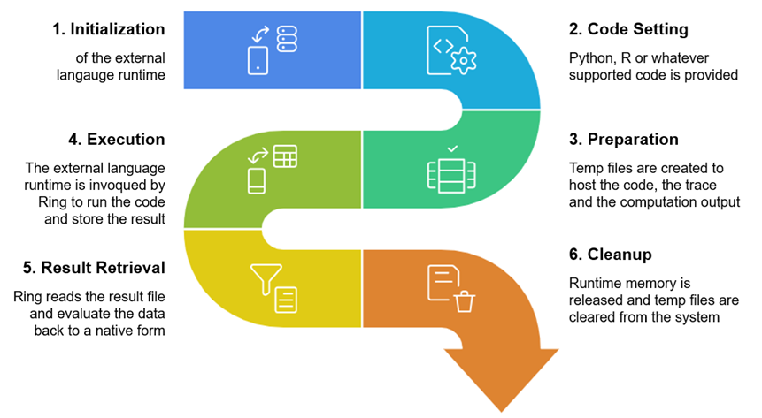

# Softanza EXCIS: Orchestrating a Polyglot Symphony

## Introduction

Modern software development requires a broad spectrum of capabilities: high-performance computing for speed, machine learning for intelligence, statistical analysis for insights, and rule-based systems for logic. Traditionally, achieving this diversity meant juggling multiple languages and tools, often leading to fragmented workflows. Softanza’s **External Code Integration System (EXCIS)** revolutionizes this by transforming **Ring**—a lightweight, flexible programming language—into a central orchestrator that seamlessly integrates multiple languages, each excelling in its domain. With EXCIS, developers can craft comprehensive solutions without ever leaving the Ring environment, harnessing the best tool for each task in a unified, streamlined way.

> **Note**: EXCIS currently supports C, Python, R, Julia, NodeJS, SWI-Prolog, and Ring, but its architecture is designed for easy extension to additional languages, making it highly adaptable to future needs.

## The Technical-to-Knowledge Domain Framework

EXCIS organizes its supported languages into a **Technical-to-Knowledge Domain Framework**, aligning each language with its core strengths to address distinct layers of software development:

1. **System Performance (C)**
   - Low-level operations and memory management
   - Performance-critical algorithms

2. **Event-Driven Systems (NodeJS)**
   - Asynchronous processing
   - Real-time data flows
   - API orchestration

3. **Scientific Computing (Julia)**
   - Mathematical modeling
   - Complex numerical simulations
   - High-performance just-in-time computation

4. **Statistical Analysis (R)**
   - Data transformation
   - Statistical modeling
   - Advanced plotting and graphics

5. **Logical Reasoning (SWI-Prolog)**
   - Rule-based systems
   - Knowledge representation
   - Declarative problem-solving with backtracking

6. **Machine Learning (Python)**
   - Model training and deployment
   - AI algorithm implementation
   - Rich ecosystem of data science libraries

7. **AI Reasoning (LLM)**
   - Natural language understanding
   - Complex reasoning and knowledge synthesis
   - Context-aware conversational logic

8. **Solution Integration (Ring)**
   - Business logic orchestration
   - Cross-domain data transformation
   - Seamless multi-paradigm scripting

This framework spans from raw technical power to high-level knowledge-driven tasks, ensuring that developers can tackle any challenge—be it a small utility or a sprawling enterprise system—using the optimal language without added complexity.

### Why Ring as the Orchestrator?
Ring is a multi-paradigm language designed for simplicity, flexibility, and rapid prototyping. Its natural language-like syntax and ease of use make it an ideal hub for integrating diverse languages. With EXCIS, Ring becomes more than a scripting language—it’s a conductor that unifies specialized tools into a cohesive workflow, allowing developers to focus on logic rather than integration overhead.

## Business Solution Requirements

Enterprise solutions often demand capabilities across multiple domains. EXCIS shines by mapping these needs to its language framework, as shown below:

| Business Solution         | C (Performance)    | NodeJS (Event)       | Julia (Scientific) | R (Statistical)         | Prolog (Logic)    | Python (ML)                | LLM (AI)              | Ring (Integration)          |
|---------------------------|--------------------|----------------------|--------------------|-------------------------|-------------------|----------------------------|-----------------------|-----------------------------|
| **Financial Trading**     | ✓✓✓ *Algorithms*   | ✓✓✓ *Data streams*   | ✓✓ *Risk models*   | ✓✓ *Analysis*           | ✓ *Rules*         | ✓ *Prediction*             | ✓✓ *News analysis*    | ✓✓✓ *Orchestration*         |
| **Healthcare Analytics**  | ✓ *Processing*     | ✓✓ *Monitoring*      | ✓✓ *Models*        | ✓✓✓ *Trials*            | ✓✓✓ *Diagnosis*   | ✓✓ *Prediction*            | ✓✓✓ *Medical research*| ✓✓ *Integration*            |
| **Smart Manufacturing**   | ✓✓✓ *Interfaces*   | ✓✓ *Monitoring*      | ✓✓✓ *Simulation*   | ✓✓ *Control*            | ✓✓ *Rules*        | ✓ *Detection*              | ✓ *Documentation*     | ✓✓ *Dashboard*              |
| **Customer Experience**   | ✓ *Processing*     | ✓✓✓ *Real-time*      | ✓ *Modeling*       | ✓✓✓ *Segments*          | ✓✓ *Rules*        | ✓✓✓ *Recommendation*       | ✓✓✓ *Personalization* | ✓✓ *Omnichannel*            |
| **Restaurant Management** | ✓✓ *Transaction PB*| ✓✓✓ *Live monitoring*| ✓ *Supply models*  | ✓✓ *Trend analysis*     | ✓✓ *Rule checks*  | ✓✓ *Demand forecast*       | ✓ *Review insights*   | ✓✓✓ *Workflow orchestration*|
| **E-Learning Platform**   | ✓ *Media encoding* | ✓✓ *Session mgmt*    | ✓✓ *Simulations*   | ✓✓✓ *Engagement metrics*| ✓✓ *Content rules*| ✓✓✓ *Personalized learning*| ✓✓ *Feedback analysis*| ✓✓✓ *Course orchestration*  |

EXCIS integrates these languages within Ring’s orchestration layer, delivering robust solutions that respect each domain’s strengths while maintaining system coherence.

## Getting Started with EXCIS

From a programmer's perspective, EXCIS provides three essential capabilities:

1. **Feeding Ring Data to External Code**: Functions like `@@R()`, `@@C()`, and `@@Plg()` serialize Ring data into formats compatible with each language.
2. **Firing External Language Runtimes**: EXCIS launches the necessary runtime environments and executes the provided code.
3. **Retrieving Results in Ring**: Outputs are automatically captured and converted back into Ring data types.

Behind the scenes, more technical work is handled automatically, as shown in the following diagram workflow:




All of this is proposed in a streamlined, very easy‑to‑use programming experience. Let's see it in action!

## Practical Example: Student Analysis Pipeline

Let’s explore EXCIS in action with a student analysis pipeline, showcasing how it chains languages for a multi-step task.

### Part 1: Statistical Analysis in R
Calculate average grades using R’s statistical prowess.

```ring
# Student grade data
students = [["Alice", [85, 90, 78]], ["Bob", [72, 65, 70]]]

# R calculates averages
R = XR()
R.SetCode('
    students <- ' + @@R(students) + '
    results <- list()
    for (i in 1:length(students)) {
        student_name <- students[[i]][1]
        grades <- students[[i]][[2]]
        results[[i]] <- list(name = student_name, mean = mean(grades))
    }
    res <- results
')
R.Run()
stats = R.Result()
# Output: [["Alice", 84.33], ["Bob", 69]]
```

> **Note** : As mentioned before, the `@@R(students)` function is actually used here to transfor the Ring `student`variable to a computable form by R language.

### Part 2: Efficient Sorting in C
Sort students by average using C’s performance edge (imagine thousands of students for real-world scale).

```ring
C = XC()
C.SetCode('
    #include <stdio.h>
    #include <string.h>
    typedef struct {
        char name[20];
        double average;
    } Student;
    int main() {
        Student students[2];
        strcpy(students[0].name, "' + @@C(stats[1][1]) + '");
        students[0].average = ' + @@C(stats[1][2]) + ';
        strcpy(students[1].name, "' + @@C(stats[2][1]) + '");
        students[1].average = ' + @@C(stats[2][2]) + ';
        printf("[\"%s\", %.2f], [\"%s\", %.2f]",
            students[0].average > students[1].average ? students[0].name : students[1].name,
            students[0].average > students[1].average ? students[0].average : students[1].average,
            students[0].average > students[1].average ? students[1].name : students[0].name,
            students[0].average > students[1].average ? students[1].average : students[0].average);
        return 0;
    }
')
C.Execute()
ranked = C.Result()
# Output: [["Alice", 84.33], ["Bob", 69]]
```

### Part 3: Rule-Based Classification in Prolog
Classify students using Prolog’s logical reasoning.

```ring
Prolog = XPlg()
Prolog.SetCode('
    classification(Average, "Excellent") :- Average >= 80.
    classification(Average, "Average") :- Average >= 70, Average < 80.
    classification(Average, "Needs Improvement") :- Average < 70.
    analyze_students(Result) :-
        Student1 = ["' + @@Plg(stats[1][1]) + '", ' + @@Plg(stats[1][2]) + '],
        Student2 = ["' + @@Plg(stats[2][1]) + '", ' + @@Plg(stats[2][2]) + '],
        classification(Student1[2], Grade1),
        classification(Student2[2], Grade2),
        Result = [[Student1[1], Grade1], [Student2[1], Grade2]].
')
Prolog.Run()
analysis = Prolog.Result()
# Output: [["Alice", "Excellent"], ["Bob", "Needs Improvement"]]
```

This pipeline demonstrates EXCIS’s ability to chain specialized languages seamlessly, with Ring as the glue.

## Revolutionizing Development with XAI Integration

The **XAI** component elevates EXCIS by integrating large language models (LLMs) as first-class runtimes, enabling natural language queries and reasoning within Ring.

```ring
AI = XAI()
AI.Query("List the top 5 African countries by population in 2024")
countries = AI.Result()
? @@(countries)
# Output: [["Nigeria", 227000000], ["Ethiopia", 126000000], ["Egypt", 112000000], ["DR Congo", 102000000], ["Tanzania", 67000000]]

AI.Query("Analyze these population figures and suggest infrastructure priorities")
analysis = AI.Result()
? analysis
# Output: "Nigeria and Ethiopia should prioritize urban infrastructure due to their large populations. DR Congo’s vast area suggests transportation needs. Egypt’s desert geography calls for water management."
```

XAI adds:
- **Natural Language Data Acquisition**: Generate data without APIs.
- **Context-Aware Analysis**: Process outputs from other languages.
- **Domain-Specific Insights**: Tailor reasoning to specific fields.
- **Automated Documentation**: Create code explanations.

An other revounary way of using XAI is to let LLMs and other AI systems generate the external language code for us from natural langauge constructs! Welcome to the upcoming stzPolyCode class…

### Polyglot Innovation with `stzPolyCode`
The `stzPolyCode` class builds on EXCIS to offer a structured polyglot programming paradigm. Unlike AI-driven “vibe-coding” that sacrifices control, `stzPolyCode` empowers developers with agency while leveraging AI, marking a forward-thinking approach detailed separately separately in this artile:

[](stzpolycode-polyglot-refinement-oriented-programming.md)

## Benefits and Considerations

EXCIS offers clear advantages:
- **Unified Workflow**: Stay in Ring, reducing context switching.
- **Optimized Performance**: Use C for speed, Python for ML, etc.
- **Simplified Maintenance**: Update one domain without rewriting everything.
- **Extensibility**: Easily add new languages.

### Addressing Concerns
- **Complexity**: EXCIS abstracts integration, keeping it simple.
- **Debugging**: Tools trace data flow across languages.
- **Overhead**: Minimal, thanks to optimized serialization and runtime handling.

## A Paradigm That Redefines Development

Unlike single-language frameworks, EXCIS embraces diversity, making Ring a conductor of specialized tools. It rivals monolithic stacks with flexibility and power, ideal for complex modern software, while remaining practical and enterprise-ready.

## Conclusion

Softanza EXCIS reimagines programming by enabling polyglot execution within a single Ring file. By blending traditional languages with LLM-driven XAI, it bridges structured coding and AI reasoning, creating a holistic development environment. More than just running code, EXCIS empowers developers to solve problems innovatively, weaving the strengths of C, Python, R, Julia, NodeJS, SWI-Prolog—and beyond—into a unified Ring tapestry. Welcome to a future where coding is a symphony, and EXCIS conducts it with brilliance.