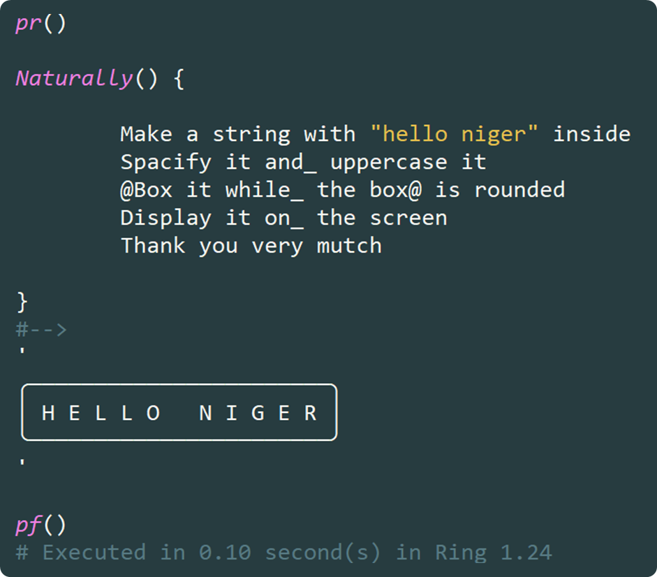
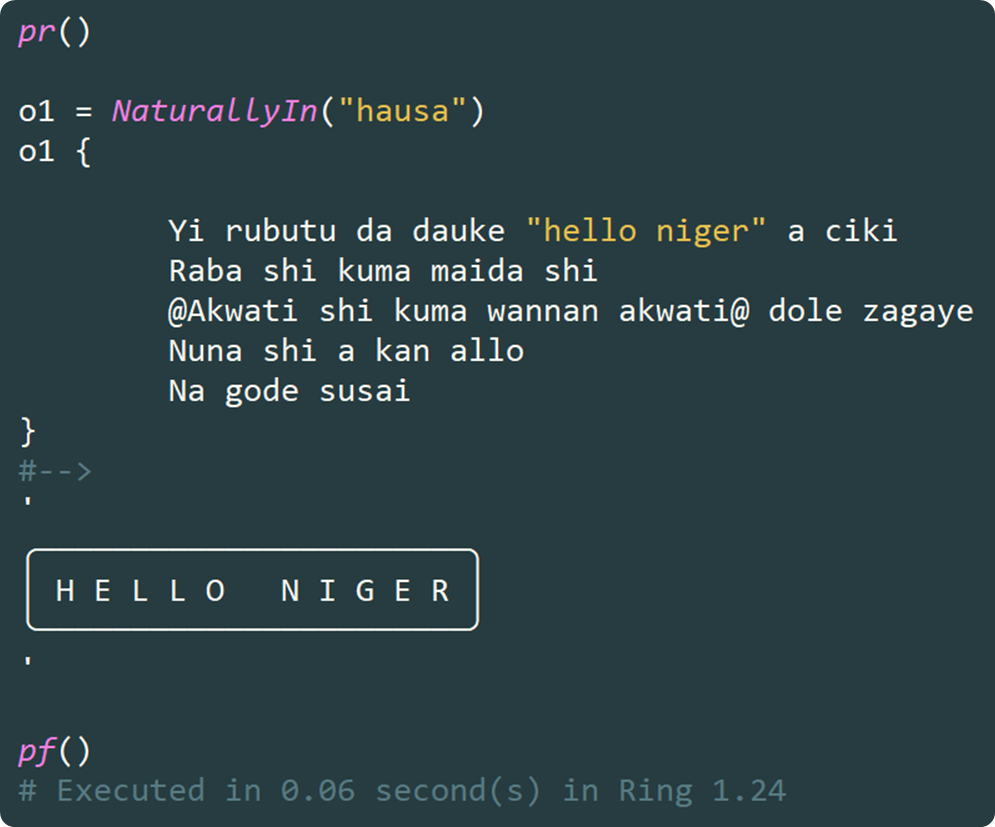
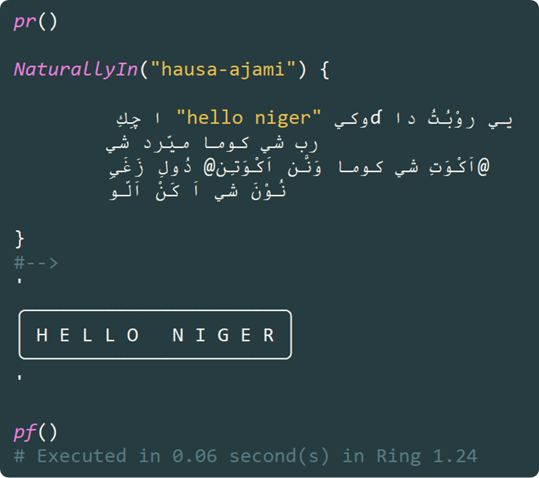

# **Natural Language Programming, Reimagined: The `stzNatural` Class in Softanza**

> *“Make a string with ‘hello Niger’ inside. Uppercase it, spacify it, and box it—rounded. Then show the result.”*  
> — Not pseudocode. Not an LLM prompt. **Real, executable Ring code.**

In a world increasingly seduced by large language models and AI-generated code,  **`stzNatural`** class—part of the **Softanza** library for the **Ring programming language**—offers a radical yet refreshingly pragmatic alternative: **natural language programming that actually runs**, at native speed, with zero external dependencies.

No NLP. No neural nets. No hallucinations. Just clean, deterministic, **data-driven code** that reads like human instruction—and executes like machine logic.

---

## 🌍 A Vision: Natural Orientation in Code

At the heart of Softanza lies a design philosophy called **natural orientation**: software should feel intuitive, expressive, and accessible—not just to engineers, but to domain experts, educators, and multilingual communities.  

`stzNatural` embodies this vision by enabling developers to write **executable natural-language commands** directly inside Ring programs. But unlike toy DSLs or brittle macro systems, `stzNatural` is:

- **Multilingual by design** (English, Hausa Latin, Hausa Ajami—and infinitely extensible),
- **Data-driven** (language rules are pure configuration, not hardcoded logic),
- **Debuggable and transparent** (you can inspect the generated Ring code at any time),
- And above all—**fast** (as fast as caling a bunch of method on a Ring object).

Let’s explore how it works—and why it matters.


## Core Architecture: Separation of Concerns, Perfected

`stzNatural` rests on three cleanly separated pillars:

### 1. **Language Definitions** (`$aLanguageDefinitions`)
A pure data structure mapping words in any language to semantic identifiers:
```ring
[:natural = "uppercase", :semantic = "METHOD_UPPERCASE"],
[:natural = "maiɗa",    :semantic = "METHOD_UPPERCASE"],   // Hausa (Latin)
[:natural = "ميّرد",     :semantic = "METHOD_UPPERCASE"]    // Hausa (Ajami)
```
Add Swahili? Arabic? Just append a new block. No recompilation needed.

### 2. **Semantic Operations** (`$aSemanticOperations`)
Language-agnostic definitions of what each semantic ID *does*:
```ring
[
  :semantic_id = "METHOD_BOX",
  :stz_signature = "@var.Box()",
  :supports_modifiers = 1,
  :modifiers = [
    [:semantic_id = "MODIFIER_ROUNDED", :stz_method = "BoxXT", :stz_param = ":Rounded = 1"]
  ]
]
```
This decouples *meaning* from *implementation*—enabling rich behaviors like modifiers.

### 3. **Execution Engine** (`stzNaturalEngine`)
The runtime that:
- Tokenizes input,
- Filters ignored words (“the”, “and”, “please”),
- Resolves semantics,
- Generates and evaluates Ring code.

All while supporting **debug mode**, **literal protection**, and **deferred references**.


## ✨ Feature Walkthrough: By Example

### 1. **Basic Object Creation & Transformation**
```ring
Naturally() {
  Create a string with "softanza" inside
  Uppercase it
  Display the result
}
#--> SOFTANZA
```

### 3. Action Application: Natural Verbs as Methods

Once an object exists, you apply actions using intuitive verbs. Here are examples from the stzString domain:

```ring
Nt = Naturally() {
    Create a stzString with "  Sample Data  "
    
    Trim it
    Uppercase it
    Show it
}
#--> SAMPLE DATA

? Nt.Code()
#-->
oStr = StzStringQ("  Sample Data  ")
oStr.Trim()
oStr.Uppercase()
? oStr.Content()
```

**Important:** These string operations are not "features" of the natural programming system itself. They're examples of how any Ring object with any methods can be naturally expressed. The system dynamically maps natural verbs to actual method calls.

### 4. **Chained Operations with Natural Connectors**
```ring
Naturally() {
  Make a string containing "ring language"
  Uppercase it and_ spacify it
  Show it
}
#--> R I N G   L A N G U A G E
```
Words like `and_`, `then_`, `plus` are **ignored**—they exist only for fluency.

### 5. **Parameterized Methods**
```ring
Naturally() {
  Create a string with "old text old"
  Replace "old" with "new"
  Display it
}
#--> new text new
```
The system intelligently treats tokens after `replace` as **literals**, even if they match known keywords.

### 6. **Modifiers via Deferred Reference (`@...@`)**
This is where `stzNatural` shines:
```ring
o1 = Naturally()
o1 {
  Create a string with "Softanza ♥ Ring"
  @box it
  The box@ should be rounded
  Display the final result
}
#-->
╭─────────────────╮
│ Softanza ♥ Ring │
╰─────────────────╯
```
The `@box ... the box@` pattern creates a **deferred reference**, allowing natural phrasing like “the box should be rounded”—a construct impossible in most DSLs.

Generated code:
```ring
? o1.Code()
#-->
'
oStr = StzStringQ("boxed text")
oStr.BoxXT([:Rounded = 1])
? oStr.Content()
'
```

> 💡 **Note**: `box` and `frame` are aliases. So are `replace`, `substitute`, `change`, and `swap`.

### 7. **Multilingual Execution**
#### English:

#### Hausa (Latin script):

#### Hausa (Ajami/Arabic script):

All produce identical output—and identical internal Ring code.

This isn’t just localization—it’s **linguistic inclusion** in programming.


## Pragmatic Safeguards

`stzNatural` avoids common pitfalls:

- **Ignored words** (like `"it"`, `"the"`) are stripped—so you can’t accidentally use them as values.
- **Unknown words** default to literals—making the system forgiving.
- **Empty or `nothing` values** are handled gracefully.
- **Debug mode** lets you trace every token and generated line.

Example of misuse:
```ring
Naturally() { Create a string with "it" }  // "it" is ignored!
// → Creates empty string: StzStringQ("")
```

## 🌱 Extensibility: Add Any Language, Any Operation

Want to support **French**?
```ring
[
  :code = "fr",
  :ignored_words = ["le", "la", "et", "avec"],
  :semantic_mappings = [
    [:natural = "créer", :semantic = "CREATE_OBJECT"],
    [:natural = "chaîne", :semantic = "OBJECT_STRING"],
    [:natural = "afficher", :semantic = "OUTPUT_DISPLAY"]
  ]
]
```

Need a **new method** like `encrypt`?
1. Add to `$aSemanticOperations`:
   ```ring
   [:semantic_id = "METHOD_ENCRYPT", :stz_signature = "@var.Encrypt()"]
   ```
2. Map natural words in any language:
   ```ring
   [:natural = "encrypt", :semantic = "METHOD_ENCRYPT"],
   [:natural = "chiffrer", :semantic = "METHOD_ENCRYPT"]
   ```

Done. No engine changes. No recompilation.


## Why This Matters

In an era where “AI coding assistants” generate fragile, opaque, and often incorrect code, `stzNatural` proves that **clarity, control, and expressiveness** can coexist—without sacrificing performance or determinism.

It enables:
- **Teaching programming** in local languages,
- **Domain-specific scripting** for non-programmers (e.g., “format this report, box the title, and email it”),
- **Readable automation** that stakeholders can audit and understand.

And it does so **within the Ring language itself**—no external servers, no black boxes.


## Conclusion: Natural, But Not Naive

`stzNatural` is not about mimicking human conversation. It’s about **leveraging natural language as a structured interface** to deterministic computation.

By separating **vocabulary**, **semantics**, and **execution**, Softanza provides more than a class—it provides a **blueprint for inclusive, maintainable, and joyful programming**.

> **Natural programming shouldn’t require magic.**  
> With `stzNatural`, it just requires **Ring**—and a little poetry.