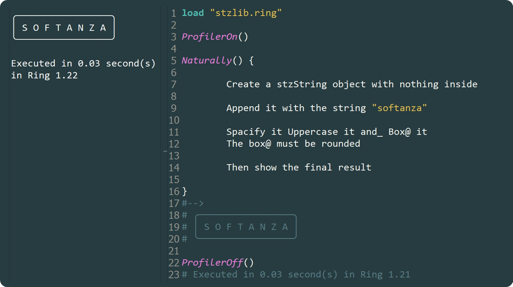
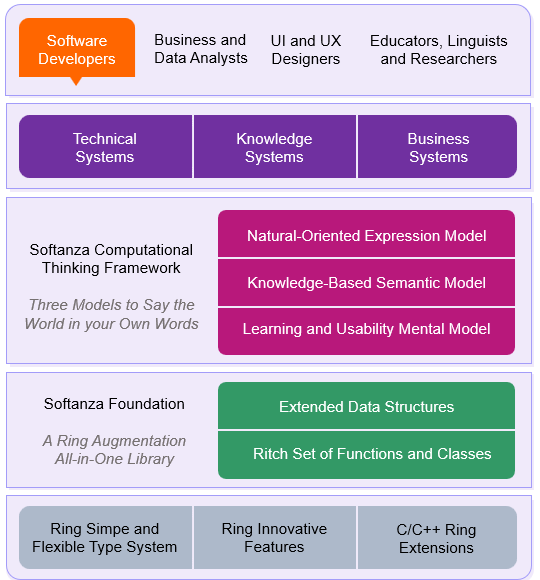

# Softanza: Bridging Minds and Code - A Humanistic Approach to Programming 
  
*A multi-generational family joyfully sitting around a bag of vibrant flowers.*

Softanza is an innovative approach to programming that dissolves the complexity of code, offering an inclusive pathway for individuals—regardless of their technical background—to transform their ideas into working software.

## Introduction

Softanza can be defined as:

- An Augmentation Library of the Ring Programming Language
- A Programming Framework for Computational Thinking
- A Systemized Foundation for Modern Software Platforms

To fulfill its mission, the Softanza Project builds on the simplicity and flexibility of Ring language to forge a tower of layered innovations. Each layer adds an incremental useful dimension to the programmer experience and a concrete value proposition to the final software solution.

NOTE: A diagram illustrating all the layers of the Softanza Project solution architecture will be provided at the end of this article.

## 1. Ring as a Computational Infrastructure of the Softanza Library and Framework

Softanza extends the Ring type system while maintaining its simplicity and well-thought design. It leverages unique Ring innovations like declarative and natural language programming and benefits from the metal force of its C and C++ extensions.

Theerefore, at its simplest form, Softanza is a library for the Ring programming language.

## 2. Softanza as an Augmentation Library of the Ring Programming Language

Softanza elevates Ring's capabilities through a comprehensive library that addresses modern development needs. Its contributions are multi-fold:

- **Filling the Gaps**: It adds the missing pieces necessary for professional, enterprise-grade applications.
- **Addressing Pain Points**: Softanza addresses the majority of usability and performance challenges encountered while developing the library with Ring.
- **Unleashing Potential**: It takes Ring's unique features and innovations, putting them into action in ways that make sense for real-world development.
- **Unified Coherence**: Softanza unifies the semantics of Ring and its extension libraries, shaping them into a coherent and powerful model.
- **Stress Testing**: By providing a real-world, large-scale codebase, it stress-tests Ring, pushing it to its limits and ensuring reliability.

While written in Ring and primarily targeting Ring programmers, Softanza's syntax and semantics are designed to be universal and technology-agnostic. Its high-level abstractions and natural orientation position it as a framework for human-centric computational thinking, capable of scaling seamlessly across programming languages.

Ultimately, Softanza can even be used without requiring any programming language other than natural language! The next section will show you this not just a promise...

> **NOTE**: In particular, a **JavaScript** port of Softanza is currently being developed to provide the same programming experience for web frontends. The SystemLayer of the library (described in Section 4 hereafter) is intended to be partially implemented in **Julia**. A full port is also planned, to align with a larger ecosystem of data-intensive and AI-driven applications.

## 3. Softanza as a Programming Framework for Computational Thinking

Computational thinking is the ability to conceptualize, design, and articulate solutions to complex problems through a programming environment that mirrors natural thought processes. Under the motto "What You Think Is What You Write", Softanza fosters this approach.

Softanza fosters computational thinking without enforcing rigid technical constraints. Simply load the library, and you can write pure Ring code like this:

```ring
load "stzlib.ring"

if Q("SOFTANZA").
	IsAMQ(:String).WhichIsQ().InUppercaseQ().
	WhileQ().ContainingQ( TheLetters([ "F", :And = "Z" ]) ).
	TheLetterQ("A").TwiceQ().
	AndQ().HavingQ().ItsQM().FirstCharQ().EqualTo("S")

	? "It's me, Softanza!"
ok

# When you run it, you get:
#--> It's me, Softanza!
```

This code illustrates Softanza's **natural-coding** paradigm, where *natural* expressions are integrated directly into computer *code*. It utilizes a `stzString` object on the surface, while being empowered internally with advanced classes like `stzChainOfTruth` and `stzChainOfValue`, demonstrating how Softanza’s programming model seamlessly integrates *logical assertions* with *value transformations* to forge a human-centered flow of thought in pure Ring code!

You can even *talk* to Softanza not in pure Ring but in *pure English*, as effortlessly and intuitively as this:

```ring
Naturally() {

	Create a stzString object with nothing inside

	Append it with the string "softanza"

	Spacify it Uppercase it and_ Box@ it
	The box@ must be rounded

	Then show the final result

}
#-->
# ╭─────────────────╮
# │ S O F T A N Z A │
# ╰─────────────────╯
```

The code instantiates an `stzNatural` object and leverages unique Ring's natural language innovations to work with words, interpret their meaning, and bind them automatically to internal Softanza classes and functions.

Here’s a snapshot of the code running in my Ring Notepad to show it in action:



Building on this Ring magic, made possible by the genius of *Mahmoud Fayed* (Ring Creator), Softanza integrates findings from the Computational Linguistics R&D efforts led by its author (me, *Mansour Ayouni*), addressing three key pillars of the thinking process: the **Semantic** Model, the **Mental** Model, and the **Expression** Model.

Let's describe briefly each model apart.


### A Knowledge-Based *Semantic Model* to Describe the Program World

This refers to the design of a semantic framework that integrates a knowledge dimension directly into your Ring code. In traditional programming, you work with variables, and at best, with objects. In Softanza, you work with real-world entities that capture the meaning and relationships you want them to convey.

To achieve this, Softanza introduces a radically intuitive way of classifying objects across multiple dimensions. For example, we define two meanings of "Apple," one as a Fruit and the other as a Company. When we ask Softanza about it, it shows that it is aware of both:

```ring
@Q("Apple").IsA(:Fruit)
@Q("Apple").IsA(:Company)
? WhatIs(:Apple) #--> [ :Fruit, :Company ]
```

Beyond simple classification, Softanza allows for deep semantic definitions of concepts, turning labels into meaningful descriptions.

In fact, if we ask it:

```ring
? WhatIs(:Fruit) #--> :Undefined
```

It responds by saying it doesn't know what :Fruit is since it hasn’t been defined. Let's define it:

```ring
@Q(:Fruit).Is("the means by which flowering plants disseminate seeds")
? WhatIs(:Fruit) #--> the means by which flowering plants disseminate seeds
```

Behind the definitions of things, Softanza binds them into meaningful relationships:

```ring
@Q(:Person).AndQ(:Fruit).CanBeRelatedByQ(:Eats)
```

At this point, Softanza doesn't care about what a :Person is; it's simply another :Undefined thing that is related to :Fruit by the verb :Eats. It's as if we’re coding the fact that humans eat fruit!

So, if we ask:

```ring
? What("Steve Jobs").Eats() #--> :Undefined
```

It won't be able to respond. However, once we define "Steve Jobs" as a :Person:

```ring
@Q("Steve Jobs").IsA(:Person)
```

Now, Softanza recognizes "Steve Jobs" as a concept related to :Fruit through the :Eats relation, and will respond correctly:

```ring
? What("Steve Jobs").Eats() #--> :Fruit
```

This example shows how Softanza transforms code from mechanical instructions into a semantic dialogue, empowering developers to craft knowledge with unprecedented flexibility and human-like understanding.

Which is empowering and exciting! But does this mean you need to learn all the semantics, functions, and classes of the library? The answer is a resounding NO.


### An Intuitive *Mental Model* to Craft Code Inside that World

Softanza is a vast library, but you shouldn’t worry about its size. All you need to know at the most basic level is:

- How to create a Softanza object and store data in it
- How to find things inside that object and return the result
- How to perform an action on the positions (or sections of positions) returned
- You may perform one or more additional actions
- Finally, you return the result

Let’s see it with some code:

```ring
# Creating a string inside a stzString object
o1 = new stzString("You and you")

# Finding the second occurrence of "YOU", regardless of case
? o1.FindNthCS(2, "YOU", FALSE)
#--> 9

# Getting it in a section of two positions
? o1.FindNthAsSectionsCS(2, "YOU", FALSE)
#--> [ 9, 11 ]

# Now, replace that section with "Me"
o1.ReplaceSection([ 9, 11 ], :With = "Me")

# Show the result
? o1.Content()
#--> You and Me
```

You’ve done it and learned all of Softanza! Literally, all its classes and functions (a lot!) work this way.

The point I want to emphasize here is that, unlike traditional programming frameworks, where you usually find yourself asking: *What should I do? And what classes and functions should I use?* In Softanza, you *know* what to do, and it’s usually the same steps of (CREATE > FIND > APPLY). And when it comes to the names of functions, you don’t even need to remember them because they are designed to reflect what you should be thinking about in natural language terms!

Often, Softanza simplifies the mental steps even further by reducing them to a single action. For example, the last algorithmic problem we solved in, say, 5 lines of code, can now be done in just one line:

```ring
o1.ReplaceNthCS(2, "YOU", :With = "You")
```

That’s it.

It’s about freeing your mind with such a mental model, allowing you to avoid the hassle of learning a large number of functions. This way, you can focus all your energy on solving your computational problem in a natural, intuitive form.


### A Natural-Oriented *Expression Model* to Talk to the World in Your Own Words!

This defines how you express your thoughts in code using a fluent, declarative, or near-natural language design. It’s not about AI code staff, but rather code that you write consciously, in collaboration with Softanza.

Whatever algorithmic problem you have, you only need to follow these simple steps:

- Select the appropriate Softanza object to hold your data (a `stzString` for text, a `stzList` for collections, a `stzNumber` for numbers, and so on).
- Type the name of the action you want to apply to the data (hopefully, it will be one of the thousands of functions shipped with Softanza).
- Continue the flow of actions by applying another action to the same data, or
- Transform the resulting data into another Softanza object type (for example, from a string to a list), and continue with other actions.
- Keep doing this until you get the final result.

Here’s a simple example: remove duplicates from "SOOFtiiiZIIii," replace the lowercase characters with "A," and then uppercase and space out the text to get a clean "S O F T A N Z A."

In Softanza, this translates to the following code:

```ring
? Q("SOOFtiiiZIIii").RemoveDuplicatesQ().ReplaceLowercaseCharsQ(:with = "A").SpacifyQ().Content()
#--> S O F T A N Z A
```

Compare the narration of the problem with the code. Aren’t they identical?

Furthermore, you can track the history of changes by adding an `H()` prefix to the small `Q()` function and ending the chain by calling the `History()` method:

```ring
? QH("SOOFtiiiZIIii").RemoveDuplicatesQ().ReplaceLowercaseCharsQ(:with = "A").SpacifyQ().Content()
#--> [
#       "SOOFtiiiNZiiii",
#       "SOFtiNZi",
#       "SOFtANZA",
#       "SOFTANZA",
#       "S O F T A N Z A"
# ]
```

But wait—Softanza does all this to ultimately empower innovators to bring transformational digital solutions to the market that truly make a difference!


## 4. Softanza as a Systemized Foundation for Modern Software Platforms

At its core, Softanza is an accelerative foundation for building modern software platforms and bringing them to the market economy. It achieves this through:

- **Systems-Based Approach**: Softanza champions a systems-based methodology to software engineering, enabling rapid prototyping and reducing time-to-delivery.

- **Simplified Architectural Patterns**: Architectural patterns like knowledge-oriented programming and reactive programming are simplified into a smooth, accessible experience.

- **Performance Meets Accessibility**: Built on high-performance C and C++ solutions, Softanza wraps them in an accessible coding model.

- **Global Software Readiness**: It natively supports Unicode, multilingual programming, and locale-specific functionality.

- **Cross-Platform Delivery**: With support for all platforms enabled by Ring, Softanza also provides an API-first delivery model through a dedicated and robust Softanza Application Server.

## 5. Softanza as a Collaborative, Multi-Disciplinary, Humanized Coding Experience

Softanza's computational thinking perspective empowers a wide range of stakeholders—business analysts, information designers, data analysts, UI and UX designers, educators, and researchers—to contribute meaningfully. Through its "What You Think Is What You Write" approach, Softanza enables each person to express themselves naturally within a shared coding environment.

All they need to do is embrace Softanza's Mental Model and natural coding paradigm and start creating working prototypes for their programs, leaving the final implementation details to the coders at a lower level.

In practice, Business Analysts, UX Designers, Educators, Researchers, and Linguists alike would benefit from this approach: 

- **Business Analysts** will craft executable specifications and build the business-specific domain language (DSL) to define the software's core logic, ensuring alignment with business needs.
  
- **UX Designers** will not just create wireframes; they will design the UI structure and interactions directly in declarative code, enabling them to test and iterate on prototypes seamlessly.

- **Educators** and **Researchers** can embed real, executable programs written in near-natural language into their tutorials and research papers, offering hands-on learning experiences for their audiences.

- **Linguists** can model language structures and processes directly in code, bridging the gap between linguistic theory and practical applications in software. 


## Wrapping Up: The Softanza Solution Architecture Diagram

A diagram is worth a thousand words, so here it is:




*Layers of the Softanza Project Solution Architecture.*

## Conclusion

Softanza is more than just a programming framework—it's an invitation to a simpler, more intuitive way of writing code and building software. By embracing computational thinking and fostering collaboration across disciplines, Softanza makes programming accessible, efficient, and aligned with human thought processes.