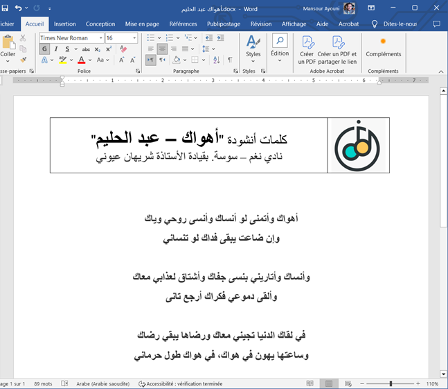
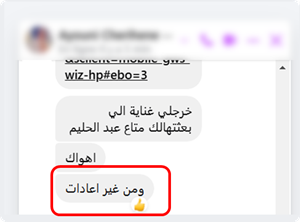
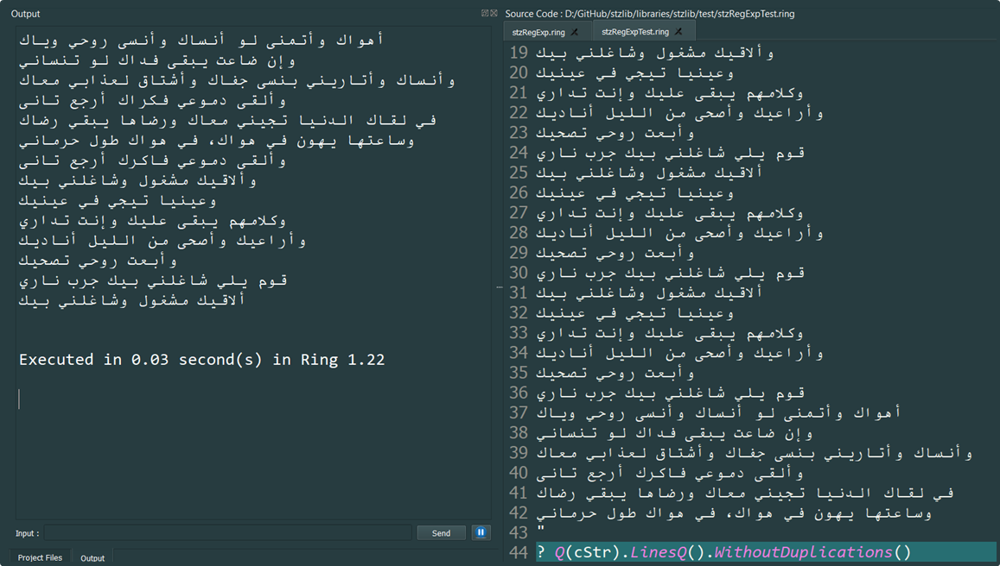

# Softanza Library: Built on Real-World Needs  

You may think Softanza's large feature set is daunting, but believe me, each singular function has its story rooted in a real-world need, shapeing every aspect of the library—from its features and programming style to its data structures and documentation.  

---

The Softanza library comes packed with thousands of features, yet each one is deeply rooted in practical, real-world use cases. As the library's designer, I introduce new features only when they solve a tangible problem or when I anticipate they’ll meet developers’ needs. Even the simplest features are developed systematically, implemented at a thoughtful level of abstraction, and always aligned with Softanza’s core principles: expressiveness, flexibility, and reliability.

In this article, I’ll share one of my journeys developing these features, illustrating how real-life challenges inspire innovation.

## Real-Life Inspiration

My wife runs a music club where participants learn to sing classical Arabic songs. Every Sunday morning, she sends me a message with a list of songs I need to prepare. This involves:
1. Searching for the lyrics online.
2. Cleaning the text.
3. Formatting it into a Word document for printing and distribution.

*The final Word document I need to produce.*

Here’s the challenge: the lyrics I find online are often cluttered with unnecessary repetition. Song transcriptions typically include every repeated phrase as performed by the singer—this is impractical for my wife’s needs. She frequently reminds me to remove duplicates when preparing new songs.

*The reminder my wife sent me to avoid duplication!*

Manually removing duplicates is tedious and disruptive, especially when I’m deep in thought about critical aspects of Softanza’s design.

#To eliminate this recurring chore, I developed the `RemoveDuplicates()` function in the `stzList` class. With this powerful feature, I can fulfill such requests in seconds rather than minutes:  

  
*Softanza to the rescue with `RemoveDuplicates()`: Input on the right, output on the left!*  

Naturally, creating this functionality required implementing several intermediary methods, such as:  
- `FindDuplicates()` – Identifies all duplicates in the list.  
- `ReplaceDuplicates()` – Replaces duplicates with specified values.  
- `CountDuplicates()` – Counts the occurrences of duplicates.  
- `ContainsDuplicates()` – Quickly checks if duplicates exist.  

In keeping with Softanza's principles of consistency and versatility, these methods were implemented in both the `stzList` and `stzString` classes.  

## Expanding the Spectrum of Features  

But the journey didn’t end there. While `RemoveDuplicates()` solved part of the problem, I still needed to:
1. Extract the song text from the internet link she provides.
2. Format the cleaned lyrics into a Word document.

To fully automate this workflow, I envisioned additional Softanza features:

1. **`fromURL()` in `stzString`:** Captures webpage content as plain text.
2. **`OnlyArabic()` or regular expression matching:** Filters out non-Arabic text.
3. **`toDOCX()`:** Exports text content into a Word document.

While some of these features, like `fromURL()` and `OnlyArabic()`, are already implemented, others remain on my to-do list.

---

## Borrowing from Reality  

This example highlights how every feature in Softanza is inspired by practical challenges, bridging the gap between real-world problems and elegant programming solutions. Nearly every function in Softanza has its own story—born out of necessity and crafted with purpose. One day, I hope to share all these stories, offering a glimpse into how Softanza continuously evolves to meet the demands of the real world.