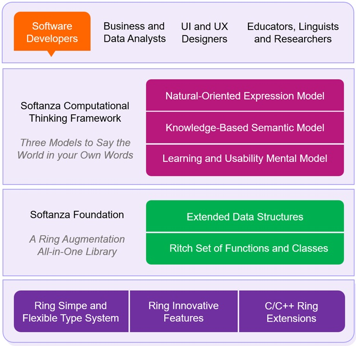

# Softanza: A Programming Environment for the Rest of Us  
  
*A multi-generational family joyfully sitting around a bag of vibrant flowers.*

I am Mansour, the designer of Softanza, a framework born out of my mission to simplify programming for everyone—not just seasoned coders, but anyone willing to write code. Let me tell you what Softanza truly is and why I believe it matters.

## Introduction: The Big Picture

At its simplest form, Softanza is a library for the Ring programming language.

## 1. An Augmentation Library of the Ring Programming Language

Softanza is an augmentation library for Ring, adding critical features that elevate the language to enterprise-grade levels. Its contributions are multi-fold:

- **Filling the Gaps**: It adds the missing pieces necessary for professional, enterprise-grade applications.
- **Addressing Pain Points**: Softanza solves most of the usability and performance challenges that programmers encounter with Ring.
- **Unleashing Potential**: It takes Ring’s unique features and innovations, putting them into action in ways that make sense for real-world development.
- **Unified Coherence**: Softanza unifies the semantics of Ring and its extension libraries, shaping them into a coherent and powerful model.
- **Stress Testing**: By providing a real-world, large-scale codebase, it stress-tests Ring, pushing it to its limits and ensuring reliability.

While written in Ring, Softanza isn’t limited to it. Its high-level abstraction and natural orientation promote it as a framework for humanized computational thinking that scales across languages.

## 2. A Programming Framework for Computational Thinking

Softanza is designed to be a non-restrictive framework that cultivates computational thinking. It doesn't force a specific software architecture or complex machinery of tools. You simply load it and write pure Ring code.

As a framework for computational thinking, it addresses three key pillars of any thinking process: the Semantic Model, the Learnning Model, and the Expression Model, all backed by a ritch algorithmic foundation that has a direct function to nerely any need.

### Ring as a Comptational Infrastucture of the Softanza Framewrok

### An One-Stop Foundation for all your Algorithmic Needs

It's like .NET for c# programmers that let them stay home while devloping any kind of application, or the Wolfram Language that has a function for any imaginable computational need, or the Qt frmaeowrk for C++ programmers...

- A comprehensiove type system that extends the native Ring Type System (number, string, list, object) with extended versions (stzNumber, stzString, stzList, and their parent stzObject)
- A set of specific variations of each type (stzHexNumber, stzBigNumber... ; stzListOfNumbers, stzListOfLists... ; stzTable, stzHashList, stzGrid...)
- thousand s of methods covering a wide range of alogrothmic needs

### A Semantics Model to Describe your Application World

This refers to the semantics of the world your code addresses, represented through an extensive set of data structures, carefully designed as feature-rich Softanza objects.

### A Mental Model to Master Softanza Programming World

This is the minimal understanding needed to master thousands of the library's features, formed of well-defined, easy-to-learn steps.

### An Expression Model to Talk of your World in Softanza Words

This defines how you express your thoughts in code using a fluent-oriented, declarative, or near-natural language design.

### How Softanza Implements These Models

To support these models, Softanza implements several technical innovations, such as:

- Uniform naming engineering for intuitive code.

- Multiple forms of functions inspired by human language—active, passive, and even negative forms.

- Novel paradigms like natural-coding, conditional-code, and the WCYP (Walker-Checker-Yielder-Performer) metaphor.

- An Entity Semantic Framework that abstracts the real world, bringing it directly into code.

- The ability to write pure Ring code that resembles natural language, without requiring additional processing, middleware, or AI. This is a cornerstone of the natural-coding paradigm.

- Hundreds of embedded DSLs for solving the most recurrunt algorithmic problems, all unified in overall external DSL

That said, Softanza is not just about thinking; it's about creating software that enables successful businesses in reasonable time and budget, aligned with today’s technological and economic landscape.

## 3. An Accelerative Foundation for Modern Software Platforms

At its core, Softanza is an accelerative foundation for building modern software platforms and bringing them to the market economy. It achieves this through:

- **Systems-Based Approach**: Softanza champions a systems-based methodology to software engineering, enabling rapid prototyping and reducing time-to-delivery.

- **Simplified Architectural Patterns**: Architectural patterns like knowledge-oriented programming and reactive programming are simplified into a smooth, accessible experience.

- **Performance Meets Accessibility**: Built on high-performance C and C++ solutions, Softanza wraps them in an accessible coding model.

- **Global Software Readiness**: It natively supports Unicode, multilingual programming, and locale-specific functionality.

- **Cross-Platform Delivery**: With support for all platforms enabled by Ring, Softanza also provides an API-first delivery model through a dedicated and robust Softanza Application Server.

Finally, what truly sets Softanza apart is its ability to turn traditionally peripheral roles into first-class citizens of the software development process, fostering inclusivity and collaboration. It bridges the gap between coders and other contributors, integrating them seamlessly into the programming project.

## 4. A Collaborative, Multi-Disciplinary Coding Experience

Softanza’s computational thinking perspective empowers a wide range of stakeholders—business analysts, information designers, data analysts, UI and UX designers, educators, and researchers—to contribute meaningfully. Through its "What You Think Is What You Write" approach, Softanza enables each person to express themselves naturally within a shared coding environment.

All they need to do is embrace Softanza’s Mental Model and natural coding paradigm and start creating working prototypes for their programs, leaving the final implementation details to the coders at a lower level.

In practice, Business Analysts, UX Designers, Educators, Researchers, and Linguists alike would benefit from this approach. Let's explore how: 

- **Business Analysts** will craft executable specifications and build the business-specific domain language (DSL) to define the software's core logic, ensuring alignment with business needs.
  
- **UX Designers** will not just create wireframes; they will design the UI structure and interactions directly in declarative code, enabling them to test and iterate on prototypes seamlessly.

- **Educators** and **Researchers** can embed real, executable programs written in near-natural language into their tutorials and research papers, offering hands-on learning experiences for their audiences.

- **Linguists** can model language structures and processes directly in code, bridging the gap between linguistic theory and practical applications in software. 

---

## Conclusion

Softanza is more than just a programming framework—it's an invitation to a simpler, more intuitive way of writing code and building software. By embracing computational thinking and fostering collaboration across disciplines, Softanza makes programming accessible, efficient, and aligned with human thought processes.