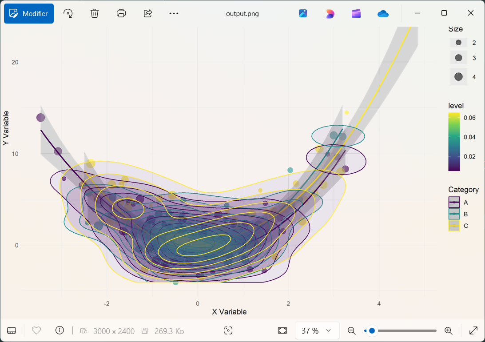

# R() in Ring: Statistical Power, One Call Away

Softanza makes it easy to integrate R, a powerful language for statistics and visualization, into Ring. The `R()` function allows you to run R scripts directly within Ring, bringing R’s analytical capabilities into your workflow without switching environments.

Here’s how you can use `R()` in Softanza to execute R scripts, retrieve structured results, and work seamlessly between the two languages.

> NOTE: For the feature to work, R must be installed on your system and accessible from the system's PATH.
.
## Running Basic Numeric Operations

The simplest use of `R()` is running a short R script and retrieving the results. Here’s an example that calculates the mean of a set of numbers:

```ring
pr()

R() {
@('    
    data <- list(
        numbers = c(1, 2, 3, 4, 5),
        mean = mean(c(1, 2, 3, 4, 5))
    )
')

Run()
? @@(Result())
}
```

Output:
```
[
    [ "numbers", [1, 2, 3, 4, 5] ],
    [ "mean", 3 ]
]
```

## Handling Nested Lists with Different Data Types

R supports complex data structures like nested lists. Softanza’s `R()` function lets you work with these easily:

```ring
pr()

R = new stzRCode
R.SetCode('
    numbers <- c(12, 15, 18, 22, 25)
    data <- list(
        basic_stats = list(
            numbers = numbers,
            mean = mean(numbers),
            median = median(numbers),
            has_outliers = FALSE
        ),
        metadata = list(
            description = "Sample dataset",
            date_created = format(Sys.Date(), "%Y-%m-%d")
        )
    )
')

R.Execute()
? @@( R.Result() )
```

Output:
```
[
    ["basic_stats",
        [ [ "numbers", [12, 15, 18, 22, 25] ],
          [ "mean", 18.40 ],
          [ "median", 18 ],
          [ "has_outliers", 0 ] ]
    ],
    ["metadata",
        [ [ "description", "Sample dataset" ],
          [ "date_created", "2025-02-24" ] ]
    ]
]
```

## Handling Missing Values (NA)

R offers built-in tools for handling missing data. Here’s how Softanza lets you integrate that functionality:

```ring
pr()

R() {
@('    
    measurements <- c(23.5, NA, 22.1, 24.3, NA, 21.8)
    data <- list(
        measurements = measurements,
        analysis = list(
            complete_cases = sum(!is.na(measurements)),
            mean_without_na = mean(measurements, na.rm = TRUE),
            na_positions = which(is.na(measurements))
        )
')

Run()
? @@( Output() )
}
```

Output:
```
[
    [ "measurements", [ 23.50, "", 22.10, 24.30, "", 21.80 ] ],
    [ "analysis",
        [ [ "complete_cases", 4 ],
          [ "mean_without_na", 22.93 ],
          [ "na_positions", [2, 5] ] ]
    ]
]
```

## Statistical Calculations

You can also use `R()` for more complex statistical analysis, such as computing summary statistics and quartiles:

```ring
pr()

R = R()

R.SetCode('
    temperatures <- c(18.2, 19.5, 22.1, 23.4, 25.8, 26.9, 27.5, 28.1, 26.8, 25.2)
    data <- list(
        raw_data = temperatures,
        statistics = list(
            mean = mean(temperatures),
            sd = sd(temperatures),
            quartiles = quantile(temperatures, probs = c(0.25, 0.5, 0.75)),
            range = range(temperatures)
        ),
        analysis = list(
            above_25 = sum(temperatures > 25),
            percent_above_25 = mean(temperatures > 25) * 100
        )
    )
')

R.Execute()
? @@( R.Result() )
```

Output:
```
[
    [ "raw_data", [ 18.20, 19.50, 22.10, 23.40, 25.80, 26.90, 27.50, 28.10, 26.80, 25.20 ] ],
    [ "statistics",
        [ [ "mean", 24.35 ],
          [ "sd", 3.44 ],
          [ "quartiles", [ 22.43, 25.50, 26.88 ] ],
          [ "range", [ 18.20, 28.10 ] ] ]
    ],
    [ "analysis", [ [ "above_25", 6 ], [ "percent_above_25", 60 ] ] ]
]
```

## Nested Calculations with Custom Functions

Softanza’s `R()` function lets you define and execute custom R functions seamlessly within Ring. Here’s an example where we analyze two numerical groups, compute key metrics, and compare them:

```ring
pr()

R = new stzRCode

R.SetCode('
group_a <- c(15, 18, 21, 24, 27)
group_b <- c(22, 25, 28, 31, 34)
calculate_metrics <- function(values) {
    list(
        mean = mean(values),
        variance = var(values),
        coefficient_variation = sd(values) / mean(values) * 100
    )
}

data <- list(
    groups = list(
        group_a = group_a,
        group_b = group_b
    ),
    metrics = list(
        group_a_metrics = calculate_metrics(group_a),
        group_b_metrics = calculate_metrics(group_b)
    ),
    comparison = list(
        mean_difference = mean(group_b) - mean(group_a),
        ratio = mean(group_b) / mean(group_a)
    )
)
')

R.Execute()
? @@( R.Result() )

proff()
# Executed in 0.32 second(s) in Ring 1.22
```

The result gives a structured view of the data, metrics, and comparisons, all computed in a single `R()` call:

```
[
	[
		"groups",
		[
			[ "group_a", [ 15, 18, 21, 24, 27 ] ],
			[ "group_b", [ 22, 25, 28, 31, 34 ] ]
		]
	],
	[
		"metrics",
		[
			[
				"group_a_metrics",
				[ [ "mean", 21 ], [ "variance", 22.50 ], [ "coefficient_variation", 22.59 ] ]
			],
			[
				"group_b_metrics",
				[ [ "mean", 28 ], [ "variance", 22.50 ], [ "coefficient_variation", 16.94 ] ]
			]
		]
	],
	[
		"comparison",
		[ [ "mean_difference", 7 ], [ "ratio", 1.33 ] ]
	]
]
```

## Time Series Analysis and Aggregation

With `R()`, working with time series data is effortless. The following example generates synthetic daily values over a month, computes weekly means and standard deviations, and extracts trend indicators:

```ring
pr()

R() {

SetCode('
dates <- as.Date("2024-01-01") + 0:29  
values <- rnorm(30, mean = 100, sd = 15)
data <- list(
    time_series = list(
        dates = format(dates, "%Y-%m-%d"),
        values = values
    ),
    weekly_stats = list(
        week_means = tapply(values, ceiling(seq_along(values)/7), mean),
        week_sds = tapply(values, ceiling(seq_along(values)/7), sd)
    ),
    trends = list(
        overall_trend = coef(lm(values ~ seq_along(values))),
        volatility = sd(diff(values))
    )
)
')

Execute()
? @@( Result() )

} 

proff()
# Executed in 0.32 second(s) in Ring 1.22
```

This example showcases how `R()` enables time series manipulation and statistical aggregation in one integrated step:

```
[
	[
		"time_series",
		[
			[ "dates", [ "2024-01-01", "2024-01-02", ...,  "2024-01-30" ] ],
			[ "values", [ 116.31, 98.84, ..., 87.77, 92.12 ] ]
		]
	],
	[
		"weekly_stats",
		[
			[ "week_means", [ 99.69, 108.34, 92.70, 91.40, 89.95 ] ],
			[ "week_sds", [ 10.97, 16.15, 6.34, 15.47, 3.08 ] ]
		]
	],
	[
		"trends",
		[
			[ "overall_trend", [ 106.51, -0.58 ] ],
			[ "volatility", 18.97 ]
		]
	]
]
```

## Advanced Data Visualization – Complex Scatter Plot with Density

When working with R’s powerful visualization tools, `R()` gives you full access to `ggplot2`, `plotly`, and more. The following example generates a complex scatter plot with density contours and trend lines, saving it as an image:

> NOTE: The libraries mentioned above should have been installed on your R instance first.

```ring
pr()

R = new stzRCode

R.SetCode('
library("ggplot2")
library("plotly")
library("viridis")

set.seed(123)
n_points <- 200
x <- rnorm(n_points, mean = 0, sd = 1.5)
y <- x^2 + rnorm(n_points, mean = 0, sd = 2)
categories <- factor(sample(c("A", "B", "C"), n_points, replace = TRUE))
sizes <- runif(n_points, 1, 5)

df <- data.frame(
    x = x,
    y = y,
    category = categories,
    size = sizes
)

p <- ggplot(df, aes(x = x, y = y, color = category)) +
    geom_point(aes(size = size), alpha = 0.6) +
    geom_smooth(method = "loess", se = TRUE) +
    stat_density_2d(aes(fill = after_stat(level)), geom = "polygon", alpha = 0.1) +
    labs(
        title = "Complex 2D Visualization",
        subtitle = "Scatter plot with density contours and trend lines",
        x = "X Variable",
        y = "Y Variable",
        color = "Category",
        size = "Size"
    ) +
    theme_minimal()

ggsave("output.png", p, width = 10, height = 8, dpi = 300)

data <- list(
    plot_info = list(
        filename = "output.png",
        dimensions = list(
            width = 10,
            height = 8,
            dpi = 300
        ),
        data_points = n_points
    ),
    statistics = list(
        x = list(
            mean = mean(x),
            sd = sd(x),
            range = range(x)
        ),
        y = list(
            mean = mean(y),
            sd = sd(y),
            range = range(y)
        ),
        correlation = cor(x, y)
    ),
    categories = list(
        levels = levels(categories),
        counts = as.list(table(categories))
    )
)
')

R.Execute()
View("output.png") # Opens the datviz image in the default system viewer

proff()
# Executed in 2.92 second(s) in Ring 1.22
```

A sleek and dynamic visualization is automatically crafted and seamlessly saved as an image:



## Everything R Can Do, R() Can Too

These examples demonstrate a simple truth: **everything possible in R is possible in `R()`**. Whether you're working with data frames, time series, custom functions, or advanced graphics, `R()` integrates seamlessly into Ring, unlocking the full potential of statistical computing with minimal effort.

