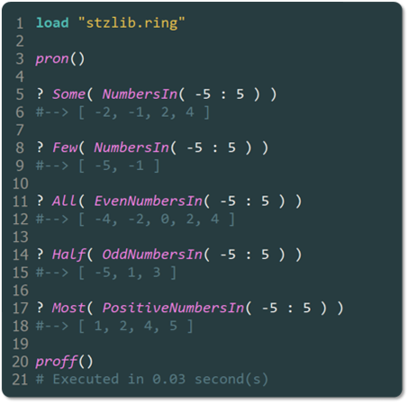

# Probabilistic Quantifiers in Softanza: Natural Proportions Meet Logical Precision

*A continuous path leading toward a grand pyramid structure.*

Softanza introduces **probabilistic quantifiers** like `Few()`, `Some()`, `Most()`, and `All()`, allowing for more intuitive data manipulation by reflecting natural language. These quantifiers map conversational terms to precise proportions, making code both expressive and clear.

---

## Basic Examples

Here’s how these quantifiers can be used in practice:

```ring
load "stzlib.ring"

? Some( NumbersIn( -5 : 5 ) )
#--> [ -1, -4, -5, 3 ]

? Most( PositiveNumbersIn( -5 : 5 ) )
#--> [ 1, 2, 4, 5 ]
```

Each probabilistic quantifier corresponds to a default proportion of items:
- `Few()` → 10%
- `Some()` → 30%
- `Most()` → 90%

You can also customize these proportions using commands like `SetFew(0.15)` or `SetMost(0.85)`.

## The Probabiliistic Continuum

These quantifiers form a continuum:  
**`No()` → `Few()` → `Some()` → `Half()` → `Many()` → `Most()` → `All()`**

They’re especially powerful when used in probabilistic and random contexts, like so:

```ring
SetSome(0.4)

? Some( RandomNumbersIn(1:10) )
#--> [ 5, 2, 7, 9 ]

? Few( RandomNumbersInU(1:10) ) # "U" for Unique items
#--> [ 1, 4 ]
```

For completeness, the `All()` and `No()` quantifiers are straightforward:
- `All()` returns all items in a list.
- `No()` returns an empty list.

Example:

```ring
? All([ "A", "B", "C" ])
#--> [ "A", "B", "C" ]

? No([ "A", "B", "C" ])
#--> []
```
## A Sense of Semantic Beauty

For semantic convenience, alternative function names like `AllOf()`, `NoOne()`, and `NoOneOf()` are provided, making the expressions more natural:

```ring
Them = [ "Andy", "Bill", "Chris" ]

? AllOf(Them)
#--> [ "Andy", "Bill", "Chris" ]

? NoOneOf(Them)
#--> [ ]
```

Softanza also supports fluent forms of these functions, which can enhance code readability. By using the `Q()` suffix, we get more natural expressions:

```ring
MyExamNotes = [ 12, 17, 18, 16, 19 ]
Them = MyExamNotes # Semantic alias for clarity
Average = 10

? AllOfQQ(MyExamNotes).ArePositive()
#--> TRUE

? AllOfQQ(Them).AreGreaterThan(Average)
#--> TRUE
```

> **NOTE**: The `Q(aList)` function promotes `aList` to a `stzListObject`, and `QQ(aList)` promotes it to a specific type of Softanza list, like `QQ([1, 2, 3])`, which returns a `stzListOfNumbers` object. This allows the use of specialized functions like `ArePositive()`, `AreGreaterThan()`, etc.


## Logical Magic with Quantifiers

Let’s dive into some logical magic with quantifiers. We’ll start with the `NothingIn()` quantifier, which works as the exact opposite of the `No()` quantifier we saw earlier. I’ll prefix it with `QQ()` because I’m working with a list of email addresses and want to promote it to a `stzListOfStrings` object to check the emails against a regular expression pattern.

Now, here’s where it gets even more exciting—I’ll add the magical `X()` suffix!

The `X()` suffix offers a powerful mechanism to express logical statements declaratively and verify them directly. In this case:
- `NothingInQQX()` checks whether **none** of the elements in the list satisfy a condition.
- `EverythingInQQX()` checks whether **all** of them do.

Here’s an example of how it works:

```ring
? NothingInQQX([ "aee@net", "@com.com", "--?mail@org" ]).MatchesX(rxp(:eMail))
#--> TRUE  # No element in the list matches the email pattern.

? NothingInQQX([ "aee@net", "@com.com", "--?mail@org", "info@mail.com" ]).MatchesX(rxp(:eMail))
#--> FALSE # At least one element matches the email pattern.

? EverythingInQQX([ "hello@mail.com", "info@mail.org" ]).MatchesX(rxp(:eMail))
#--> TRUE  # All elements match the email pattern.

? EverythingInQQX([ "hello@mail.com", "info@mail.org", "~;@com" ]).MatchesX(rxp(:eMail))
#--> FALSE # Not all elements match the email pattern.
```

This approach combines intuitive expression with precise logic, allowing for clear and concise condition validation.

> **NOTE**: The `rxp(:email)` utility returns the regular expression pattern for a valid email: `"^[a-zA-Z0-9._%+-]+@[a-zA-Z0-9.-]+\.[a-zA-Z]{2,}$"`.

---

## Conclusion

Probabilistic quantifiers in Softanza enhance coding fluency, bridging the gap between natural language and precise logic. They enable expressive, easy-to-read code while still maintaining the power of rigorous validation. This exemplifies Softanza’s commitment to making programming both intuitive and efficient.

**See them in action in Ring Notepad hereafter:**

