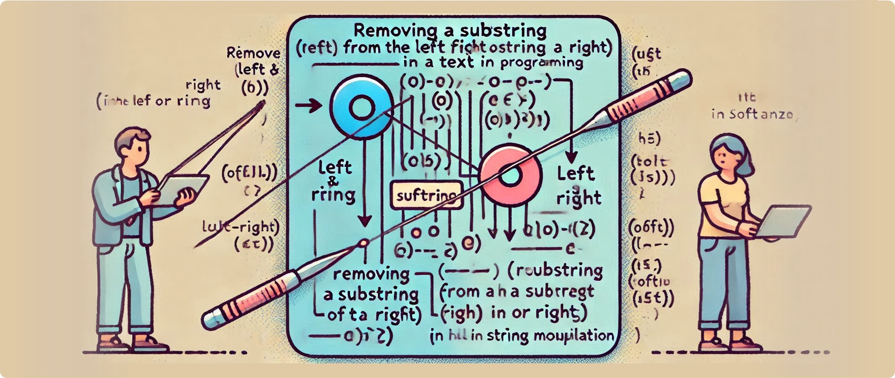

# Simplifying Orientation in String Removal with Softanza


In text manipulation, removing a substring from the left or right of a string is a common task, but it can quickly become tricky when handling languages with different orientations, such as Arabic. Softanza's `stzString` class addresses this challenge by offering both specific and generalized solutions for managing string content seamlessly.

---

## Traditional Approaches: Left and Right Removal

Softanza provides two straightforward functions to remove substrings:

1. **`RemoveFromLeft()`**: Removes a substring from the left side of the string.  
2. **`RemoveFromRight()`**: Removes a substring from the right side of the string.

For example:
```ring
pron()

o1 = new stzString("let's say welcome to everyone!")
o1.RemoveFromLeft("let's say ")
? o1.Content()
#--> welcome to everyone!

proff()
```

This works well for languages like English, where text flows left to right. However, things get less intuitive with right-to-left (RTL) languages like Arabic.  


## The RTL Challenge: Left and Right Confusion

Consider an Arabic sentence:  
```ring
o1 = new stzString("هذه الكلمات الّتي سوف تبقى")
? o1.NRightCharsAsSubstring(4) #--> "هذه "
```

To remove the substring `"هذه "` (which appears visually at the start), you would use `RemoveFromRight()` instead of `RemoveFromLeft()`. Why? Because for an RTL string, **"right"** corresponds to the start of the text, and **"left"** corresponds to the end.

```ring
o1.RemoveFromRight("هذه ")
? o1.Content() #--> "الكلمات الّتي سوف تبقى"
```

This reversal in directionality can cause confusion, especially for developers working with multilingual systems.  


## A Semantic Solution: Start and End Removal

To eliminate orientation-based complications, Softanza introduces two semantic alternatives:

1. **`RemoveFromStart()`**: Removes a substring from the logical start of the string, regardless of the text's orientation.  
2. **`RemoveFromEnd()`**: Removes a substring from the logical end.

Using these, the same task becomes simpler and more intuitive:
```ring
pron()

o1 = new stzString("let's say welcome to everyone!")
o1.RemoveFromStart("let's say ")
? o1.Content()
#--> welcome to everyone!
```

And for Arabic text:
```ring
o1 = new stzString("هذه الكلمات الّتي سوف تبقى")
o1.RemoveFromStart("هذه ")
? o1.Content() #--> "الكلمات الّتي سوف تبقى"
```


## Why It Matters

The `RemoveFromStart()` and `RemoveFromEnd()` functions embody Softanza's commitment to **semantic programming**—designing functions that align with human logic rather than the technicalities of text representation. 

Whether you're working with left-to-right English text or right-to-left Arabic, these functions provide:

- **Clarity**: No need to second-guess the directionality of your text.
- **Consistency**: The same code works for all orientations, reducing bugs in multilingual applications.
- **Ease of Use**: Developers can focus on their logic without worrying about the underlying mechanics of text rendering.

---

## Conclusion

Softanza simplifies string manipulation for multilingual and bidirectional text environments, ensuring developers can write clean, intuitive, and error-free code. The semantic approach of `RemoveFromStart()` and `RemoveFromEnd()` highlights the library's attention to detail and user-centered design.