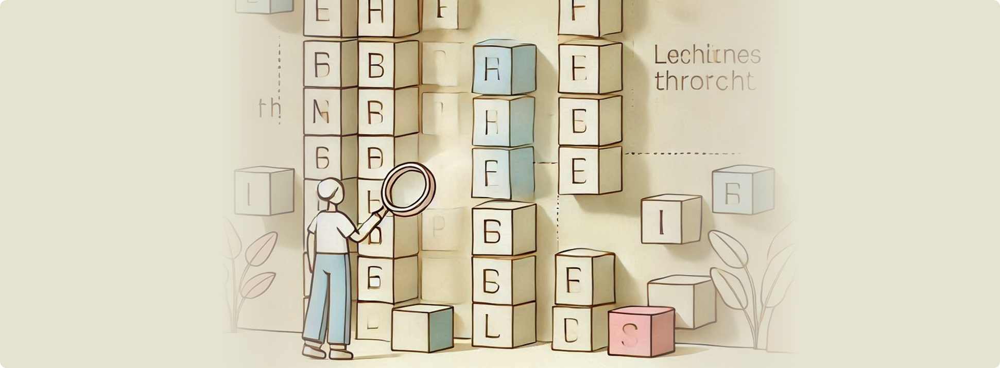

# Visual Sequence Finding in Softanza


Softanza transforms string sequence finding in Ring language from a basic search operation into a **visually rich experience**. Let's explore its features through practical examples.

---

## Core Features

### 1. Basic Finding

Let's start with searching for "ring" within a jumble of letters using the straightforward `Find()` method, which returns the list of **positions** where the sequence appears:

```ring
load "stzlib.ring"

o1 = new stzString("fjringljringdjringg")
? @@( o1.Find("ring") )
#--> [ 3, 9, 15 ]
```

>**NOTE**: The `@@(val)` function (resembling two glasses one puts on to improve sight) returns a readable, string-based representation of the value `val`, regardless of its type.


### 2. Visual Enhancement

We can add a visual dimension by using the `viz` **prefix** with `Find()`, making the positions easy to spot:

```ring
? o1.**viz**Find("ring")
#-->
# fjringljringdjringg
# --^-----^-----^----
```

### 3. Enhanced Visual Output
To gain even more insight, we can add the `XT()` **suffix**, providing a `:Numbered` guide for each matched position:

```ring
? o1.**viz**Find**XT**("ring", [ **:Numbered = TRUE** ])
#-->
# fjringljringdjringg
# --^-----^-----^----
#   3     9     15
```

>**NOTE**: The `**XT**()` suffix, when appended to a Softanza function, signifies an e**XT**ended outcome of the basic feature in question. In our case, it's about providing a **list of options**, such as `[ **:Numbered = TRUE** ]` above, and others that we will discover later.


### 4. Section Finding

The `Find**AsSections**()` method (or simply `Find**ZZ**()`) offers a different perspective by returning each sequence position as a **pair** of start and end positions:

```ring
? @@( o1.Find**AsSections**("ring") ) # Or simply Find**ZZ**()
#--> [ [3, 6], [9, 12], [15, 18] ]
```

>**NOTE**: If you try `Find**Z**()` instead of `Find**ZZ**()`, you'll see that both `**Z**()` and `**ZZ**()` return positions, but the first **as numbers** and the second **as sections** (pairs of numbers). Whatever your need, such smart yet powerful Softanza tiny **suffixes**, applied to almost any function, will have you covered!


### 5. Sectioned Visualization

The sections can be visualized using the `:Sectioned` option, which clearly shows the **boundaries** of each match:

```ring
? o1.vizFindXT("ring", [ **:Sectioned = TRUE**, :Numbered = TRUE ])
#-->
# fjringljringdjringg
#   '--'  '--'  '--'
#   3  6  9 12  15 18
```

### 6. Full Structured Visualization

For the most sophisticated display, we can combine **boxing**, **sectioning** and **numbering** options to create a highly structured and detailed view:

```ring
? o1.vizFindXT("ring", [
	**:Boxed = TRUE**, 
	:Rounded = TRUE, 
	**:Sectioned = TRUE**, 
	:Numbered = TRUE 
])
#-->
╭───┬───┬───┬───┬───┬───┬───┬───┬───┬───┬───┬───┬───┬───┬───┬───┬───┬───┬───╮
│ f │ j │ r │ i │ n │ g │ l │ j │ r │ i │ n │ g │ d │ j │ r │ i │ n │ g │ g │
╰───┴───┴─•─┴───┴───┴─•─┴───┴───┴─•─┴───┴───┴─•─┴───┴───┴─•─┴───┴───┴─•─┴───╯
          '-----------'           '-----------'           '-----------'
          3           6           9         12            15         18
```

>**NOTE**: If you try `:Numbered**XT** = TRUE` instead of just `:Numbered = TRUE`, you'll see that the **XT** suffix forces the display of positions **for all** the characters, not just the **sections** defined, which can be useful in some cases.


## Why It Matters

### Technical Excellence

- **Minimal design** and execution overhead through a pure declarative experience
- **Progressive visualization** from basic positions to sectioned views
- **Multiple representation** options (positions, sections, visual markers, chars boxes)
- **Flexible customization** through combined options and smart defaults

### Development Impact

1. **Debugging**: Instant visual identification of sequences and their boundaries
2. **Analysis**: Clear representation of sequence positions and sections
3. **Documentation**: Professional, readable output with multiple visualization options
4. **Teaching**: Intuitive demonstration of string concepts and sequence locations

## Design Philosophy: The Visual Approach in Softanza

The sequence finding feature demonstrates Softanza's core design philosophy: transforming console output into meaningful visual representations. This approach:

- **Makes Operations Visible**: Each visualization carries clear meaning about the operation being performed - sections show boundaries, numbers provide precise positions, and box drawings create structure
- **Leverages Console Power**: Rich visual feedback without GUI libraries, using just ASCII and Unicode thoughtfully
- **Sets a Pattern**: The visual elements introduced here (markers, sections, boxes) establish a language that extends to other Softanza operations with lists, grids, and more

---

## Conculsion

Softanza sequence finding solution showcases how console output can be both **beautiful** and **deeply functional**, making abstract algorithmic operations immediately understandable.
