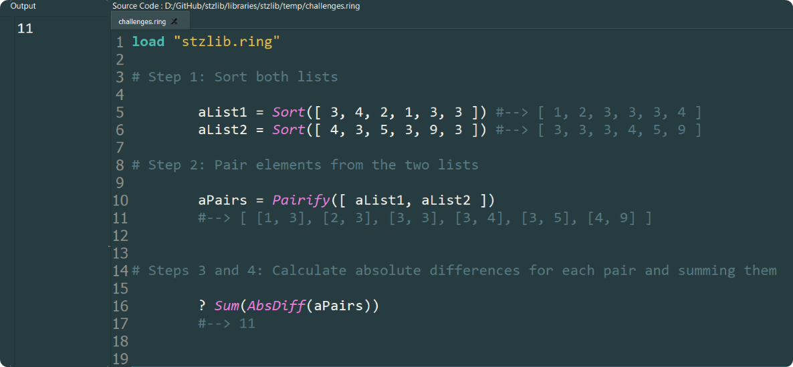

# Tackling Advent of Code 2024 with Softanza - Part 1  

The **Advent of Code 2024 - Day 1 Challenge** tasks us with computing the total "distance" between two lists of numbers. This involves sorting the lists, pairing their elements, calculating absolute differences, and summing these differences to obtain the final result. The complete problem description is available [here](https://adventofcode.com/2024/day/1).  

---

While seemingly simple, such problems have real-world relevance in areas like logistics and data reconciliation. Softanza, a foundational library for the Ring programming language, simplifies this process with tools like `Sort()`, `Sum()`, `Pairify()`, and `AbsDiff()`. These functions encapsulate common operations, allowing for a concise and expressive solution.  

## The Code  

Softanza is designed to align with human reasoning, translating natural problem-solving thought processes directly into code—a principle embodied in its "What You Think Is What You Write" motto. Let’s see this in action as we follow the four steps outlined in the challenge:  

```ring
load "stzlib.ring"

# Step 1: Sort both lists

	aList1 = Sort([ 3, 4, 2, 1, 3, 3 ])	#--> [ 1, 2, 3, 3, 3, 4 ]
	aList2 = Sort([ 4, 3, 5, 3, 9, 3 ]) 	#--> [ 3, 3, 3, 4, 5, 9 ]

# Step 2: Pair elements from the two lists

	aPairs = Pairify([ aList1, aList2 ])
	#--> [ [1, 3], [2, 3], [3, 3], [3, 4], [3, 5], [4, 9] ]


# Steps 3 and 4: Calculate absolute differences for each pair and summing them

	? Sum(AbsDiff(aPairs))
	#--> 11
```  

Challenge raised in just 4 lines of code! Who can do more ;) ?

Here’s a snapshot of the solution in Ring NotePad:


