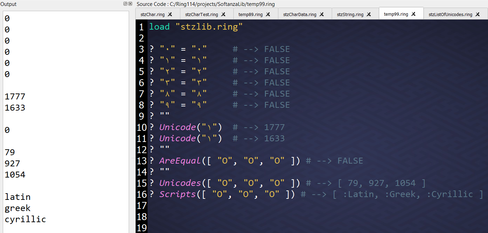

# Unmasking Unicode Lookalikes
The world of Unicode characters is vast and sometimes fraught with challenges, particularly when it comes to the visual similarity between characters that are fundamentally different. Let’s explore some examples of this phenomenon and discover how Softanza can provide an elegant solutions to it.

---

## The Problem

Do you think "۰" and "٠" are the same?

No, they’re not! Nor are these: "۱" and "١," "۲" and "٢," or "۳" and "٣."

Let’s see what happens when you check them for equality in Ring:

```ring
load "stzlib.ring"

? "۱" = "١"  #--> FALSE
? "۲" = "٢"  #--> FALSE
? "۳" = "٣"  #--> FALSE
? "۸" = "٨"  #--> FALSE
? "۹" = "٩"  #--> FALSE
```  

Surprising, isn’t it? It doesn’t end there. Consider characters like "O", "Ο", and "О". These look nearly identical but they are distinct:  

```ring
? "O" = "Ο"  #--> FALSE  
? "O" = "О"  #--> FALSE  
? "Ο" = "О"  #--> FALSE  
```  

This could pose serious security risks, as attackers might exploit these visual illusions to deceive software systems. Fortunately, Softanza provides robust tools to detect and handle such scenarios effectively.  

## The Unicode Secret, unveiled!

With Softanza's **`Unicode()`** function, you can uncover the true identity of any character. Here’s how:  

```ring
? Unicode("۱")  #--> 1776
? Unicode("١")  #--> 1632
```  

Clearly, these characters look similar but are fundamentally different. The **`AreEqual()`** function further demonstrates their uniqueness:

```ring
? AreEqual("۱", "١")  #--> FALSE
```  

You can also investigate sets of visually identical characters:

```ring
? AreEqual(["O", "Ο", "О"])  #--> FALSE
? Unicodes(["O", "Ο", "О"])  #--> [ 79, 927, 1054 ]
```  

## Why Does This Happen?

The answer lies in Unicode itself. Unicode assigns a **unique code point** to each character, focusing on their identity rather than their appearance (glyph). For instance:

- Latin "O" → `79`
- Greek "Ο" → `927`
- Cyrillic "О" → `1054`

Even though these characters may appear identical, they belong to entirely different scripts. Softanza's **`Scripts()`** function reveals their origins:

```ring
? Scripts(["O", "Ο", "О"])  #--> [ "latin", "greek", "cyrillic" ]
```  

## Code in Action  

Softanza equips you with the tools to protect your software against these hidden risks, providing unparalleled control over string operations.  

Here is a snapshot of this exploration, captured in my Ring Notepad:

  


