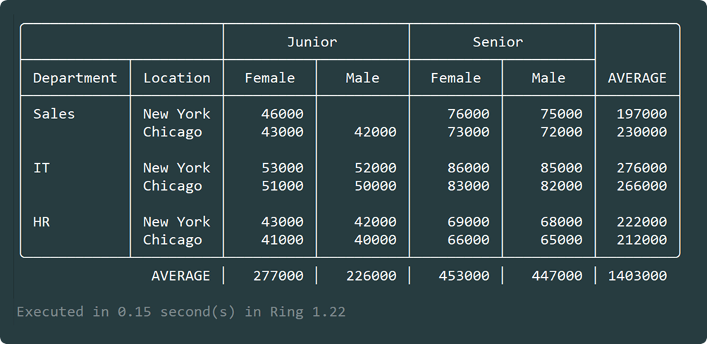

# Quick Pivot Table Analysis with Softanza

In this _QuickNote_, I'll show you how to use pivot table analysis in Softanza.

We’ll begin by defining the employee dataset within an `stzTable` object. This table captures key attributes such as department, location, gender, experience level, and salary for each employee record:

```ring
load "stzlib.ring"

oTable = new stzTable([
    [ :Department, :Location, :Gender, :Experience, "Salary" ],
    # -------------------------------------------------------- #
    [ "Sales", "New York",  "Male",   "Junior",  45000 ],
    [ "Sales", "New York",  "Female", "Junior",  46000 ],
    [ "Sales", "New York",  "Male",   "Senior",  75000 ],
    [ "Sales", "New York",  "Female", "Senior",  76000 ],
    [ "Sales", "Chicago",   "Male",   "Junior",  42000 ],
    [ "Sales", "Chicago",   "Female", "Junior",  43000 ],
    [ "Sales", "Chicago",   "Male",   "Senior",  72000 ],
    [ "Sales", "Chicago",   "Female", "Senior",  73000 ],
    [ "IT",    "New York",  "Male",   "Junior",  52000 ],
    [ "IT",    "New York",  "Female", "Junior",  53000 ],
    [ "IT",    "New York",  "Male",   "Senior",  85000 ],
    [ "IT",    "New York",  "Female", "Senior",  86000 ],
    [ "IT",    "Chicago",   "Male",   "Junior",  50000 ],
    [ "IT",    "Chicago",   "Female", "Junior",  51000 ],
    [ "IT",    "Chicago",   "Male",   "Senior",  82000 ],
    [ "IT",    "Chicago",   "Female", "Senior",  83000 ],
    [ "HR",    "New York",  "Male",   "Junior",  42000 ],
    [ "HR",    "New York",  "Female", "Junior",  43000 ],
    [ "HR",    "New York",  "Male",   "Senior",  68000 ],
    [ "HR",    "New York",  "Female", "Senior",  69000 ],
    [ "HR",    "Chicago",   "Male",   "Junior",  40000 ],
    [ "HR",    "Chicago",   "Female", "Junior",  41000 ],
    [ "HR",    "Chicago",   "Male",   "Senior",  65000 ],
    [ "HR",    "Chicago",   "Female", "Senior",  66000 ]
])
```

Now, we use this structured dataset to perform a multi-dimensional pivot using the `stzPivotTable` class. The goal is to compute the **average salary** by grouping rows by `Department` and `Location`, and categorizing columns by `Experience` and `Gender`:

```ring
oPivot = new stzPivotTable(oTable)

oPivot {
    Analyze([ :Salary ], :AVERAGE)
    SetRowsBy([ :Department, :Location ])
    SetColsBy([ :Experience, :Gender ])

    # Finally, display the pivoted data
    Show()
}
```

And here is the resulting pivot table:




